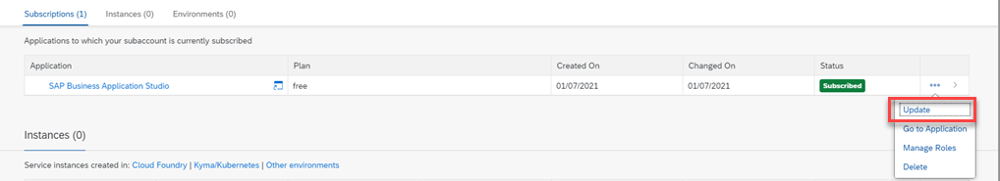

<!-- loio2c72917df87e47c290e061a556d92398 -->

# Application Plans

SAP Business Application Studio provides 2 types of application plans: free and standard-edition. Both plans are provided only in Enterprise accounts.

You select the plan when subscribing to the application. See [Subscribe to SAP Business Application Studio](Subscribe_to_SAP_Business_Application_Studio_6331319.md).

The type of plan you choose determines pricing, conditions of use, and resources. Learn about the plan details in the [Discovery Center](https://discovery-center.cloud.sap/#/serviceCatalog/business-application-studio).

Both plans provide preinstalled runtimes and tools tailored for developing key scenarios such as: SAP S/4HANA extensions, full stack business applications, SAP Fiori applications, and more. However, the free plan contains some restrictions. See [Free Plan Restrictions](Application_Plans_2c72917.md#loio2c72917df87e47c290e061a556d92398__section_v4w_f1z_tpb).

Each subaccount has only 1 subscription. If you selected the free plan and want to upgrade to the standard-edition plan, you can do so as described in [Upgrading to the Standard-Edition Plan](Application_Plans_2c72917.md#loio2c72917df87e47c290e061a556d92398__section_dzc_j1z_tpb).

You can use different plans in separate subaccounts.

<a name="loio2c72917df87e47c290e061a556d92398__section_v4w_f1z_tpb"/>

## Free Plan Restrictions

> ### Note:  
> Only community support is available for free service plans and these are not subject to SLAs. Use of free tier service plans are subject to additional terms and conditions as provided in the [SAP Business Technology Platform Supplement](https://www.sap.com/about/trust-center/agreements/cloud/cloud-services.html?tag=language:english&search=Supplement%20Business%20Technology%20Platform&sort=latest_desc).

-   A user can only have up to 2 dev spaces.

-   A user can only have 1 dev space in the RUNNING state at a time.

-   The maximum size limit of a dev space is 4 GB.

<a name="loio2c72917df87e47c290e061a556d92398__section_dzc_j1z_tpb"/>

## Upgrading to the Standard-Edition Plan

To upgrade the application subscription from the free plan to the standard-edition plan:

1.  Open your global account in the cockpit.
2.  Go to your subaccount.
3.  In the navigation area, choose *Instances and Subscriptions*.

    A list of the applications to which your subaccount is subscribed in the Cloud Foundry environment is displayed.

4.  Search for SAP Business Application Studio.
5.  Select the ellipsis at the end of the subscription row, and from the menu, select *Update*.

    

6.  In the wizard that opens, select *standard-edition plan* and click *Update Subscription*.

> ### Note:  
> -   The content of the existing dev spaces is not affected by the update.
> 
> -   No changes are made to the user permissions.
> 
> -   The free tier restrictions are not applied anymore.
> 
> -   Restart your dev space to see the extended disk space.

