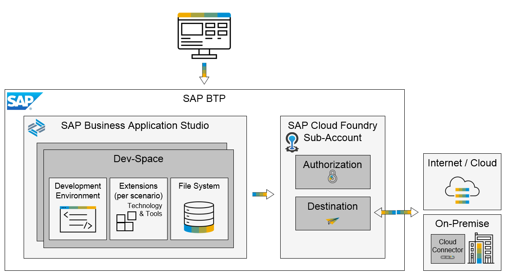

<!-- loioc93afb5743a04b62afea0fe1def00062 -->

# Architectural Overview

SAP Business Application Studio is part of SAP BTP and the SAP Multi-cloud offering \(AWS, Azure, Alibaba, etc.\).

Developers \(end users\) use a web browser to access their own dev space, personal, restricted, and tailored. The dev space is a Developer Virtual Appliance which includes everything a developer requires: development environment, technology stacks, security and connectivity instruments, developed source code, and applications.

SAP Business Application Studio is based on the SAP Cloud Foundry Business Application Pattern to provide Multi-tenant Software-as-a-Service \(SaaS\).

The Identity and Access Management \(IAM\) is based on SAP Cloud Foundry Authorization and Trust Management. Once the developers pass the authorization process, they are granted access with appropriate scopes to the dev space.

The developers can access different services \(outside of SAP BTP\), from the dev space based on the SAP Cloud Foundry destination they created. The SAP Cloud Connector is used, in addition, to provide a secured access to the on-premise landscape.

**Related Information**  

[SAP Cloud Foundry Business Application Pattern](https://help.sap.com/viewer/65de2977205c403bbc107264b8eccf4b/Cloud/en-US/a1de162dffea417eb9cccd7855c607b7.html)

[Authorization and Trust Management](https://help.sap.com/viewer/65de2977205c403bbc107264b8eccf4b/Cloud/en-US/649961f8d4ad463daca33b3a20deba4c.html)

[SAP Cloud Foundry destinations](https://help.sap.com/viewer/cca91383641e40ffbe03bdc78f00f681/Cloud/en-US/84e45e071c7646c88027fffc6a7bb787.html)

[SAP Cloud Connector](https://help.sap.com/viewer/cca91383641e40ffbe03bdc78f00f681/Cloud/en-US/e6c7616abb5710148cfcf3e75d96d596.html)

[Manage Authorizations from SAP BTP cockpit](https://help.sap.com/products/SAP%20Business%20Application%20Studio/9d1db9835307451daa8c930fbd9ab264/01e69c53003c4b0a8a64310a3f08867d.html)

[Connecting to External Systems](Connecting_to_External_Systems_7e49887.md "For applications that do not need to run on Cloud Foundry, establish a connection to an external system by creating one destination for multi-usage.")

