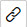

<!-- loio93f40e6a7e1a47bc9d9ee0352146fed0 -->

# Bind Data to a Simple Control

You can bind data to a simple control.

<a name="loio93f40e6a7e1a47bc9d9ee0352146fed0__steps_zjy_zqt_tr"/>

## Procedure

1.  On the canvas, select the desired control for which you want to define data binding.

2.  In the *Properties* pane to the right of the canvas, do one of the following:

    -   To the right of the property to which you want to bind data, click the *Binding*  button, and then in the *Data Binding* dialog box:
        1.  In the *Data Fields* list, double-click one or more data fields that you want to add to the expression.

            The data fields are automatically concatenated to the string in the *Expression* box.

        2.  Click *OK* or first manually edit the expression string and then click *OK*.

    -   In the *Properties* pane, for a field or dropdown list, manually enter the required expression within curly brackets \{...\} according to the data set that you selected.

