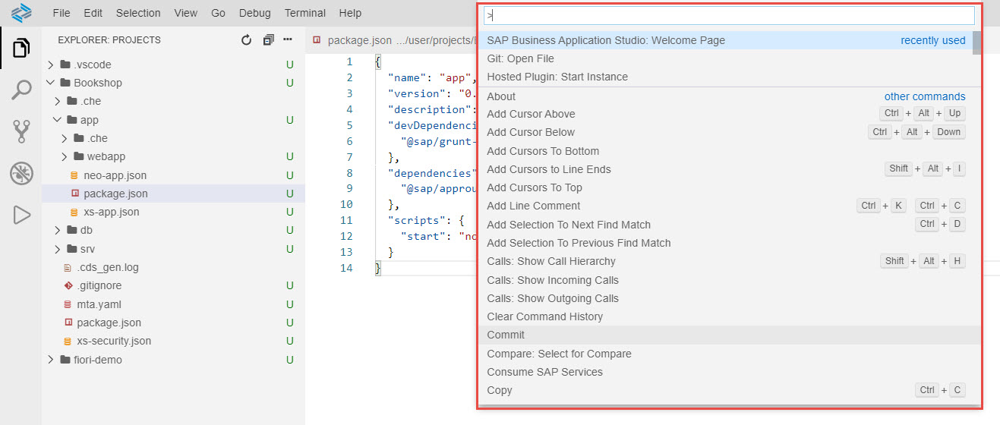

<!-- loio78788bf69e7c4834a2d3411b10c5d84a -->

# Command Palette

The command palette provides access to all the IDE functionality including shortcuts for the most common operations.

To open the command palette in SAP Business Application Studio, select *View* \> *Find Command* from the menu bar.

This will open an input field at the top of the IDE allowing you to type a command. Content assist then allows you to find commands quickly.

Some commands will lead you into a minimal text-based wizard, allowing you to enter additional parameters.

Type ***>*** into the input field to get a list of quick commands you can execute from here:

