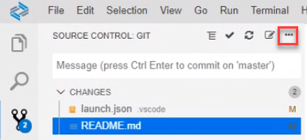

<!-- loio6b32b52648b946459305b182dbe2ccb7 -->

# Commit \(Signed Off\) Changes

Enables you to save your changes to the local repository. Sign-off is a line at the end of the commit message which certifies who is the author of the commit.

1.  From the *SOURCE CONTROL: GIT* view menu, click More Actions.

    

2.  Select *Commit \(Signed Off\)*. The commit message is sent including the signature of the comitter.

