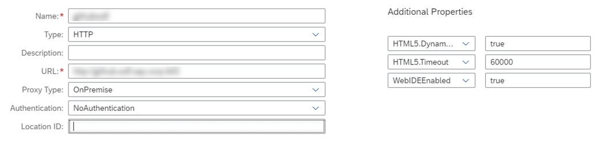

<!-- loiod54ddfc1bc4f45b19dabfa0950799685 -->

# Connecting to a Corporate Git Repository

As an administrator, you can work with on-premise Git repositories, once an appropriate destination has been created in your subaccount.

<a name="loiod54ddfc1bc4f45b19dabfa0950799685__section_rml_hxl_tnb"/>

## Providing Authentication

SAP Business Application Studio supports basic authentication, which means you must provide your username and password to access your Git provider.

> ### Note:  
> SSH is not available for on-premise Git installations.

To work with the Git view in SAP Business Application Studio, you need to store or cache credentials. Once you have enabled one of these methods, you will not have to enter your credentials every time you use Git.

> ### Note:  
> Doing this requires you to entrust your credentials to SAP and to a third party.

-   Cache credentials in memory for a short period of time. See [Git Credential Cache](https://git-scm.com/docs/git-credential-cache).

-   Store credentials indefinitely in a file on your dev space. See [Git Credential Store](https://git-scm.com/docs/git-credential-store).

You can use a **Personal Access Token** \(PAT\) instead of a password.

For example, you can create a PAT in GitHub following [these instructions](http://help.sap.com/disclaimer?site=https://docs.github.com/en/github/authenticating-to-github/creating-a-personal-access-token). Other Git providers will have different ways of creating PATs.

> ### Note:  
> PATs are an alternative to using passwords for authentication to Git, and as such, they should be frequently renewed.

<a name="loiod54ddfc1bc4f45b19dabfa0950799685__section_ysr_hxl_tnb"/>

## Connecting to Git

Make sure to use the exact same host and port as defined in the destination URL property.

> ### Note:  
> The corporate Git connectivity supports only secure HTTPS connections. HTTP, SSH and other protocols are not supported.

1.  Install and configure a Cloud Connector. For more information, see [Cloud Connector](https://help.sap.com/viewer/cca91383641e40ffbe03bdc78f00f681/Cloud/en-US/e6c7616abb5710148cfcf3e75d96d596.html).

2.  Configure the Cloud Connector to open a channel to your Git system. Follow the instructions as described in [Configure Access Control](https://help.sap.com/viewer/cca91383641e40ffbe03bdc78f00f681/Cloud/en-US/f42fe4471d6a4a5fb09b7f3bb83c66a4.html). Use the following settings:

    <table>
    <tr>
    <th>

    Field

    
    </th>
    <th>

    Value

    
    </th>
    </tr>
    <tr>
    <td>

     *Back-end Type* 

    
    </td>
    <td>

     *Non-SAP System* 

    
    </td>
    </tr>
    <tr>
    <td>

    *Protocol*

    
    </td>
    <td>

     *HTTPS* 

    
    </td>
    </tr>
    <tr>
    <td>

     *Internal Host / Port* 

    
    </td>
    <td>

    Enter the internal host and port for your Git system.

    
    </td>
    </tr>
    <tr>
    <td>

     *Host / Port* 

    
    </td>
    <td>

    Enter a virtual host and port for your Git system. You can use the same host and port as for the virtual host and port.

    
    </td>
    </tr>
    <tr>
    <td>

     *Principal Type* 

    
    </td>
    <td>

     *None* 

    
    </td>
    </tr>
    </table>
    
    For the system you just added, specify the resources to enable, using the following settings:

    <table>
    <tr>
    <th>

    Field

    
    </th>
    <th>

    Value

    
    </th>
    </tr>
    <tr>
    <td>

     *Enabled* 

    
    </td>
    <td>

    Checked

    
    </td>
    </tr>
    <tr>
    <td>

     *URL Path* 

    
    </td>
    <td>

     ***/*** 

    
    </td>
    </tr>
    <tr>
    <td>

     *Access Policy* 

    
    </td>
    <td>

     *Path and all sub-paths* 

    
    </td>
    </tr>
    </table>
    
3.  Upload your organization's Git server certificate to the cloud connector \(if your Git server is using certificate-based authentication\).
4.  If you defined a custom identity provider, make sure that you have configured the assertion-based attributes mapping for this identity provider. For more information, see [Configure Trust to the SAML Identity Provider](https://help.sap.com/viewer/65de2977205c403bbc107264b8eccf4b/Cloud/en-US/dc618538d97610148155d97dcd123c24.html#loiob6cfc4bb4bff4ace90afc71b0962fcb5).
5.  Define your corporate Git destination. For more information, see [Connect to ABAP Systems](https://help.sap.com/viewer/825270ffffe74d9f988a0f0066ad59f0/CF/en-US/5c3debce758a470e8342161457fd6f70.html).
    1.  In the SAP BTP cockpit, select *Connectivity* \> *Destinations*.
    2.  Select *New Destination*.
    3.  In the *Destination Configuration* section, set the *Proxy Type* to *OnPremise*.
    4.  In the *Additional Properties* section, configure the following:

        <table>
        <tr>
        <th>

        Property

        
        </th>
        <th>

        Value

        
        </th>
        </tr>
        <tr>
        <td>

        WebIDEEnabled

        
        </td>
        <td>

        true

        
        </td>
        </tr>
        <tr>
        <td>

        HTML5.DynamicDestination

        
        </td>
        <td>

        true

        
        </td>
        </tr>
        <tr>
        <td>

        HTML5.Timeout

        \(Optional property\)

        
        </td>
        <td>

        60000

        
        </td>
        </tr>
        </table>
        
        

<a name="loiod54ddfc1bc4f45b19dabfa0950799685__section_wtl_mbm_tnb"/>

## Using Git

Learn how to use Git in the SAP Business Application Studio Developer Guide. See [Git Source Control](Git_Source_Control_9689c07.md).

