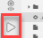

<!-- loio05cafd835c4348249d311c4e41a4f0db -->

# Creating Run Configurations for CAP Java Applications

You can create configuration settings for running your projects.

**Prerequisites**

-   Your project was created in a Full Stack Cloud Application dev space. See [Dev Space Types](Dev_Space_Types_4142f78.md).

-   Your project is based on the Cloud Application Programming Model \(CAP\). See [SAP Business Application Studio in Capire](https://cap.cloud.sap/docs/get-started/tools/#bastudio).

-   Your project must include the `pom.xml` file in your root folder.

1.  From the left-side menu, click *Run Configurations*.

    

2.  Click **+** \(Create Configuration\).

    

3.  From the command palette, select the runnable object for which you want to create the configuration.

    > ### Note:  
    > If you configured profiles for your application in the application's YAML file or in another profile-specific YAML file \(`<application>-<profile>.yaml`\), you can create a run configuration that activates and uses them.
    > 
    > 1.  Go to *File* \> *Settings* \> *Open Preferences*.
    > 2.  Search for *CAP* \> *Run Configurations* \> *Spring Boot Profile Configuration Files*.
    > 3.  Add the relevant YAML files in the field provided, separated by commas.

    A configuration tree appears in the *RUN CONFIGURATIONS* view containing the run configurations that were created for the runnable objects.

4.  \(Optional\) Bind your runtime services.

    1.  Select the desired run configuration and right-click to open the context menu.
    2.  Select the *Bind to Runtime Service*.
    3.  If promted, login to Cloud Foundry and select your org and space.
    4.  From the list of available services in the space, select the service to which you want to bind the application. The runtime service appears beneath the run configuration.
    5.  If needed, click  \(*Delete Runtime Service*\)
    > ### Note:  
    > There can only be one service of a certain type \(for example `xs-uaa`\) bound to an application per run configuration.

5.  Click  \(Run\) to run the project.

    The Debug Console Opens.

6.  Click *Open in New Tab* to view the UI in a new tab.
7.  Right-click on a run relevant configuration to do the following:
    -   *Configure Environment* - Open the environment file to view the binding configuration.

    -   *Rename* - Provide a new name for the selected run configuration.

    -   *Show in File* - Open the JSON file containing the set of configuration properties, with the name highlighted.

    -   *Delete* - Delete the set of configuration properties from the JSON file.

> ### Note:  
> Any manual change performed to the JSON files, is reflected on the configuration tree.

