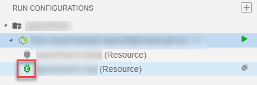
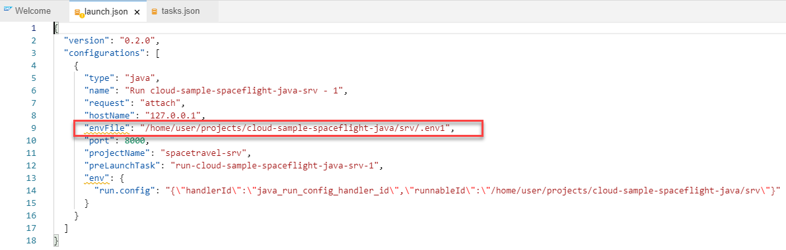
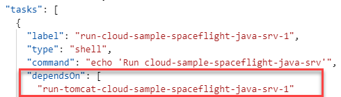

<!-- loioc20676613c0440fe9b96b10dcdf32d32 -->

# Creating Run Configurations for Java Modules

Create new run configurations to run a Java module for a multitarget application.

Run a Java module on the local Apache Tomcat server and allow binding the module's required resources to specific Cloud Foundry services.

**Prerequisites**

-   Your project must include an `mta.yaml` file that points to the Java module.

-   The Java module's `pom.xml` file must include the following definition: `packagingType= war`.

<a name="loioc20676613c0440fe9b96b10dcdf32d32__section_fx4_jzq_hkb"/>

## Add a new configuration

1.  Open the *Run Configurations* view.
2.  Click **+** \(Create Configuration\).

    

3.  Select the Java module as the runnable object.

    A new configuration is added to your `launch.json` file.

> ### Note:  
> Any manual change performed to the `launch.json` file is reflected in the configuration tree.

<a name="loioc20676613c0440fe9b96b10dcdf32d32__section_lfp_f1r_hkb"/>

## Bind dependencies

In the *Run Configurations* view, you can see the resources that are defined in the MTA descriptor. You can bind or unbind these resources to a specific Cloud Foundry service instance.

> ### Note:  
> The following Cloud Foundry service types are supported for binding:
> 
> -   `hana` \( `managed-hana` is not supported\)
>     -   PSA-based SAP HANA
>     -   HaaS \(if configured as "Available for all IPs"\)
> -   `xsuaa`
> -   `destination`
> -   `connectivity`
> -   `auditlog`
> -   `application-logs`

To bind the resource:

1.  Open the *Run Configurations* view.
2.  Select the desired configuration.
3.  Select the desired resource.
4.  Click  \(bind\).

    If not already logged in, you are prompted to log in to Cloud Foundry.

    A list of all available services that match your resource type are displayed in the command palette.

5.  Select the desired service.

The resource is bound to the service.

This updates the resource's configuration files. See the *Advanced Options* section below to see the changes mande to the configuration files.

If you are binding to an SAP HANA service, a new connection called `'<my_service_instance name>'` is added to the SQLTools view where your tables and data are displayed.

Unbinding the resource removes all of the changes made to the configuration files.

To unbind the resource:

1.  Open the *Run Configurations* view.
2.  Select the desired configuration.
3.  Select the desired resource.
4.  Click  \(unbind\).

<a name="loioc20676613c0440fe9b96b10dcdf32d32__section_ekx_f1r_hkb"/>

## Run a configuration

1.  If you bound your service to a service that requires Chisel to run:
    1.  From the command palette, choose *Task* \> *Run Task*.
    2.  Select `openChiselTunnelFor-<service name>`.

        > ### Note:  
        > If Chisel is already running in the same port and space, skip this step.

2.  Select the desired run configuration.
3.  Click  \(Run\) to run the project.

    Prelaunch and dependent tasks are run.

    The Debug Console opens.

4.  A notification prompting you to expose and open the port \(if it was not previously exposed\), or to open the service in a new tab is displayed. Click the relevant action to view the service in a new tab. See [Managing Ports](Managing_Ports_91fc8bf.md).
5.  If you need to stop a configuration that is already running, you can do so from the *Debug* view.

> ### Note:  
> For more information about the tasks triggered by the run configuration, see the *Advanced Options* section below.
> 
> Stopping a configuration from the *Debug* view does not stop any running tasks.

<a name="loioc20676613c0440fe9b96b10dcdf32d32__section_ltq_knh_jkb"/>

## Edit a Run configuration

1.  Right-click a run relevant configuration to do the following:
    -   *Configure Environment* - Open the environment file to view the binding configuration.

    -   *Rename* - Provide a new name for the selected run configuration.

    -   *Show in File* - Open the JSON file containing the set of configuration properties, with the name highlighted.

    -   *Delete* - Delete the set of configuration properties from the JSON file.

<a name="loioc20676613c0440fe9b96b10dcdf32d32__section_xs1_sth_jkb"/>

## Delete a Run configuration

1.  Right-click a run relevant configuration and choose *Delete*.

    > ### Note:  
    > If you delete the launch configuration, it is removed from the `launch.json` file but the tasks remain.

<a name="loioc20676613c0440fe9b96b10dcdf32d32__section_qyl_cbr_hkb"/>

## Advanced options

In addition to the `launch.json` file that is created as part of the new configuration, the following files are added or updated when creating a run configuration:

-   **Environment configuration file**

    A new environment file is created. After the resource is bound to a service, the file is populated with all the environment variables required to connect to Cloud Foundry.

    The environment configuration file is referenced from your `Launch` configuration.

    

-   **New tasks in the `tasks.json` file**

    The following tasks are added to the `tasks.json` file:

    -   A technical generic task. This is the configuration's prelaunch task.

        This task enables you to define additional tasks to run before starting the configuration \(using the `dependsOn` property\).

        

    -   A task that triggers the Apache Tomcat server running with the context of the application resources.

    -   A build task that triggers the `mvn clean install` command.

-   **Tomcat runtime configuration directory**

    When you create a new configuration, a new **Tomcat runtime configuration directory** is created containing the following configuration files:

    -   `ROOT.xml` \(`user/.tomcat/<configuration_name>/Catalina/localhost`\)

    For example, `/home/user/.tomcat/bookshop-srv-1/conf/Catalina/localhost`

    -   `server.xml` \(`user/.tomcat/<configuration_name>/conf`\)

    For example, `/home/user/.tomcat/bookshop-srv-1/conf`

        > ### Note:  
        > By default, Tomcat runs on port 8080. If you want to run multiple configurations at the same time, you need to configure a different port for the additional Tomcat in the `server.xml` file. In addition, you'll need to change the default ports 8009 and 8005 defined in this file to other ports to avoid collision.
        > 
        > You also need to define a debug port \(that is not the default 8000\), both in the `'run-tomcat'` task in the `tasks.json` file, and in the matching launch configuration in the `launch.json` file, which are all associated with the same run configuration.

    You can modify the content of this directory to configure Tomcat as desired for this run configuration. For example, you can add libraries to be used at runtime or change ports. For more information, see [Apache Tomcat](https://tomcat.apache.org/tomcat-7.0-doc/introduction.html).

<a name="loioc20676613c0440fe9b96b10dcdf32d32__section_pxj_grh_jkb"/>

## Binding Process

Not all of the services that you want to bind to are publicly exposed. Therefore, we must use a secure tunnel to access them from Cloud Foundry.

When binding to one of these services, we use [chisel](https://github.com/jpillora/chisel) to open a secure channel to your Cloud Foundry space.

A new task is created within the binding step to run chisel. Run this task before running the configuration.

The environment configuration file is updated with the chisel and the selected service parameters.

The Tomcat configuration files are updated according to the chosen service.

