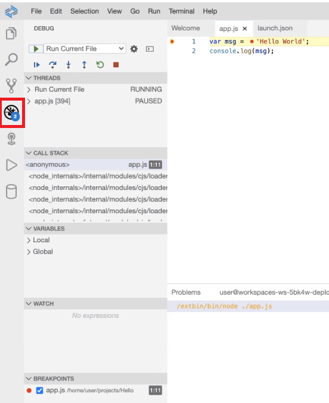
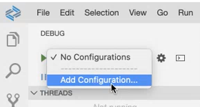
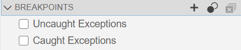
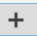

<!-- loiob8587ebc631346b2898a1adc8b9303c5 -->

# Debugging

SAP Business Application Studio has built-in debugging support for the Node.js runtime and can debug JavaScript, TypeScript, or any other language that gets transpiled to JavaScript.

<a name="loiob8587ebc631346b2898a1adc8b9303c5__section_mr4_brt_vnb"/>

## Debugging a File

To debug a node.js file:

1.  Open the Debug view.

    

2.  From the dropdown list, select *Add Configuration*.

    

    A list of configuration options is displayed.

3.  Select *Node.js*. A launch configuration file \(`launch.json`\) is created automatically. You can configure and save debugging setup details in this file.

    This file contains 3 configurations:

    -   Launch Program
    -   Create JavaScript Debug Terminal
    -   Run Current File
4.  To add a new configuration to an existing `launch.json`, from the dropdown list, select *Add Configuration*.
5.  From the dropdown list, select *Run Current File* or *Launch Program* \(which provides you the option to skip node internal files\).

    You can run your configuration through the command palette, by filtering on *Debug: Start Debugging*.

> ### Note:  
> Note that the attributes available in launch configurations vary from debugger to debugger.

<a name="loiob8587ebc631346b2898a1adc8b9303c5__section_ytz_brt_vnb"/>

## Debugging Modes

There are two core debugging modes, Launch and Attach.

The debugger can launch a program in debug mode, or it can attach to an already running program in debug mode.

You can trigger these modes from the command palette: *Debug : Attach to Node Process* 

<a name="loiob8587ebc631346b2898a1adc8b9303c5__section_xkd_crt_vnb"/>

## Breakpoints

Breakpoints can be toggled by clicking on the editor margin or using [F9\] on the current line.

You can also use the BREAKPOINTS section.

-   Click  to add a function breakpoint.
-   Click  to deactivate a breakpoint.
-   Click  to remove all breakpoints.

