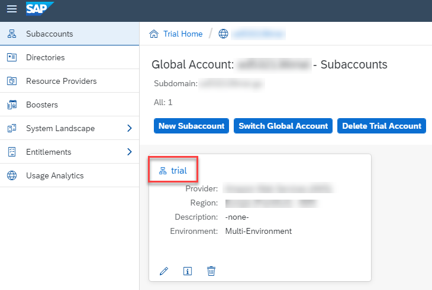

<!-- loio48ed55ec07e04a02b2218236c336321b -->

# Getting Started with a Trial Account

Set up your trial system to develop applications using SAP Business Application Studio.

1.  Sign up for an SAP BTP trial acccount. See [Get a Free Trial Account](https://help.sap.com/viewer/65de2977205c403bbc107264b8eccf4b/Cloud/en-US/d61c2819034b48e68145c45c36acba6e.html#loio42e7e54590424e65969fced1acd47694)

    > ### Note:  
    > An SAP BTP trial account is free of charge. However, every trial user gets one trial account only.

2.  In the SAP BTP trial cockpit, click *Enter Your Trial Account*.

    Your global account opens containing a subaccount called *trial* that is automatically created and already subscribed to SAP Business Application Studio.

    

    This subaccount contains everything you need to work on SAP Business Application Studio, there is no need to create a different subaccount.

    > ### Note:  
    > Your first subaccount is automatically subscribed to SAP Business Application Studio. Any other subaccount that you create or any other user that you add requires a manual subscription and role assignment. See the [Getting Started](https://help.sap.com/viewer/9d1db9835307451daa8c930fbd9ab264/Cloud/en-US/19611ddbe82f4bf2b493283e0ed602e5.html) topic of the Administrator Guide.

    1.  Click *New Subaccount*.
    2.  Provide the subaccount details, and click *Create*.
    3.  Click the subaccount name to open it.
    4.  From the side menu, select *Entitlements*.
    5.  Click *Configure Entitlements*.
    6.  Click *Add Service Plan*.
    7.  In the *Entitlements* dialog, search for ***studio***.
    8.  Select **SAP Business Application Studio**.
    9.  Under *Available Plans*, select the *trial* checkbox.
    10. Click *Add 1 Service Plan*.
    11. Save your changes.

