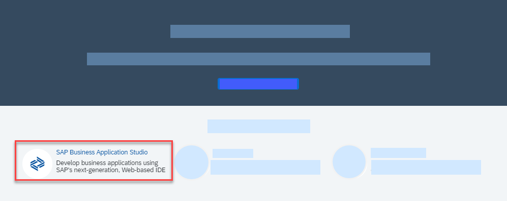

<!-- loio48ed55ec07e04a02b2218236c336321b -->

# Getting Started with a Trial Account

Set up your trial system to develop applications using SAP Business Application Studio.

1.  Sign up for an SAP BTP trial account. See [Get a Free Trial Account](https://help.sap.com/viewer/65de2977205c403bbc107264b8eccf4b/Cloud/en-US/d61c2819034b48e68145c45c36acba6e.html#loio42e7e54590424e65969fced1acd47694).

    > ### Note:  
    > An SAP BTP trial account is free of charge. However, every trial user gets one trial account only.
    > 
    > Your trial account contains a subaccount called *trial* that is automatically created and already subscribed to SAP Business Application Studio.
    > 
    > Any other subaccount that you create requires a manual subscription. See [Creating a New Subaccount](Creating_a_New_Subaccount_c44668e.md).

2.  Open the SAP BTP trial cockpit.
3.  From the *Quick Tool Access* section, click *SAP Business Application Studio*.

    

    *SAP Business Application Studio* opens.

4.  Click *Create Dev Space* to begin working.

