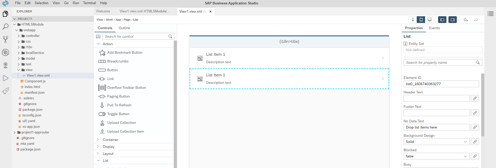
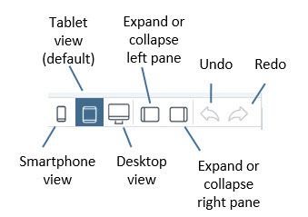
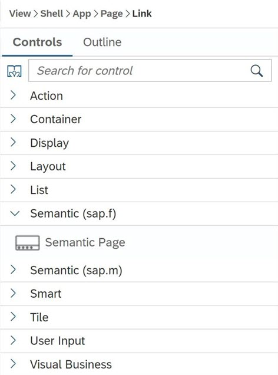
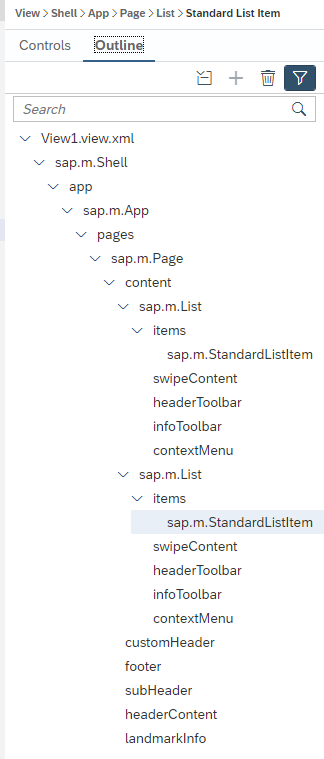
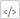
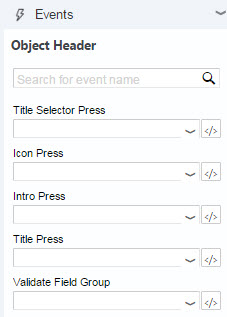
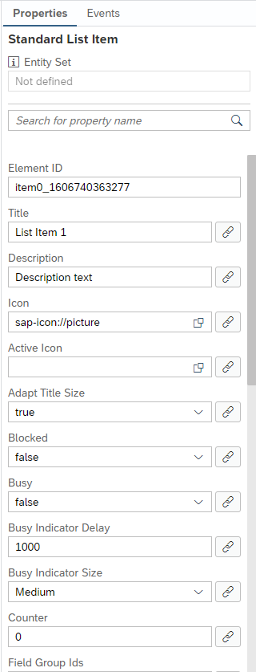

<!-- loio90ba99ae9af64f76a3da593e44ca5b9f -->

# Layout Editor

Display the content of an XML view in the layout editor to see it in a way that closely corresponds to how it will appear in your finished application.

> ### Note:  
> The layout editor is not supported in the Safari browser.

<a name="loio90ba99ae9af64f76a3da593e44ca5b9f__section_itd_gcc_xnb"/>

## Layout Editor Landscape

The layout editor is composed of a canvas, a pane on the left that includes the *Controls* and *Outline* tabs, and a pane on the right that includes the *Properties* pane.*Events* and *Properties* panes.

<a name="loio90ba99ae9af64f76a3da593e44ca5b9f__section_jtd_gcc_xnb"/>

## Toolbar

The buttons on the layout editor toolbar allow you to:

-   Change the device format of the canvas to smartphone, tablet, or desktop view.

-   Expand and collapse the panes to the right and left of the canvas.

    -   The pane on the left side includes the *Controls* and *Outline* tabs.

    -   The pane on the right side includes the *Properties* pane.

        The pane on the right side includes the *Properties* and *Events* panes.

-   Undo and redo actions.

<a name="loio90ba99ae9af64f76a3da593e44ca5b9f__section_ktd_gcc_xnb"/>

## Controls Tab

You can expand or collapse each section by clicking the arrow on each section header. You can also search for controls by entering the control name in the search field at the top of the *Controls* tab. The relevant sections expand to display the controls that match the search criteria.

> ### Note:  
> Make sure to delete the search criteria if you want to expand other sections.

You can drag and drop controls from the *Controls* tab onto the canvas. For more information, see [Add Controls from the Controls Tab](Add_Controls_from_the_Controls_Tab_82d8438.md).

You can find the list of available controls in [SAPUI5 Controls Supported in the Layout Editor](SAPUI5_Controls_Supported_in_the_Layout_Editor_c5d123e.md).

<a name="loio90ba99ae9af64f76a3da593e44ca5b9f__section_ltd_gcc_xnb"/>

## Outline Tab

Controls that are selected on the *Outline* tab are automatically selected on the canvas and vice versa.

You can use the *Outline* tab to see the hierarchy of controls on the canvas. In addition, you can add and remove controls from the canvas using the *Outline* tab.

For more information, see [Add Controls from the Outline Tab](Add_Controls_from_the_Outline_Tab_1cf5a5b.md).

<a name="loio90ba99ae9af64f76a3da593e44ca5b9f__section_mtd_gcc_xnb"/>

## Canvas

The canvas in the middle of the layout editor area provides a graphical display of the selected XML view.

Click a control on the canvas to select it. To select a parent control, hold *Ctrl* and click. You can keep clicking until you reach the highest control in the hierarchy and then the focus will return to the original control. Click outside the canvas to undo the selection.

**Properties Pane****Events and Properties Pane**

On the right side of the canvas is a pane that displays the following pane:

On the right side of the canvas is a pane that displays the following panes:

<a name="loio90ba99ae9af64f76a3da593e44ca5b9f__section_ntd_gcc_xnb"/>

## Events Pane

The *Events* pane allows you to select an existing event handler from the controller for an event of the selected control. The  icon next to each event opens the code editor to display the relevant controller in the XML code.

> ### Note:  
> The *Events* pane is not currently supported.

<a name="loio90ba99ae9af64f76a3da593e44ca5b9f__section_otd_gcc_xnb"/>

## Properties Pane

The *Properties* pane shows the properties of the control that is currently selected in the canvas and allows you to modify its property values. The most commonly used properties for each control are displayed at the top of the list. The  icon next to each property opens the *Data Binding* dialog box.

For more information, see [Binding Data](Binding_Data_c24e9c4.md), [Bind Data to a Simple Control](Bind_Data_to_a_Simple_Control_93f40e6.md), and [Bind Data to an Aggregate-Type Control](Bind_Data_to_an_Aggregate-Type_Control_2ea1358.md).

> ### Note:  
> Deprecated properties or aggregations are marked with the label *deprecated* \(also in the *Outline* tab\). For more information, see *SAP Library for User Interface Add-On 1.0 for SAP NetWeaver* on SAP Help Portal at [http://help.sap.com/nw-uiaddon](http://help.sap.com/nw-uiaddon). Under *Application Help*, open *SAP Library*, and search for *deprecation*.

-   **[Working with the Layout Editor](Working_with_the_Layout_Editor_8fbbaad.md "An overview of the steps required to edit a project using the layout editor.")**  
An overview of the steps required to edit a project using the layout editor.
-   **[SAPUI5 Controls Supported in the Layout Editor](SAPUI5_Controls_Supported_in_the_Layout_Editor_c5d123e.md "Provides a list of SAPUI5 controls that are supported in the layout editor.")**  
Provides a list of SAPUI5 controls that are supported in the layout editor.

**Related Information**  

[Working with the Layout Editor](Working_with_the_Layout_Editor_8fbbaad.md "An overview of the steps required to edit a project using the layout editor.")

[SAPUI5 Controls Supported in the Layout Editor](SAPUI5_Controls_Supported_in_the_Layout_Editor_c5d123e.md "Provides a list of SAPUI5 controls that are supported in the layout editor.")

