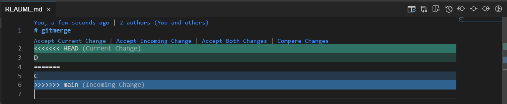

<!-- loio588c283f301c42bf94871d3ba6f47f92 -->

# Merge Changes

You can incorporate all the changes from one branch into another in a single commit.

To merge a branch into another:

1.  From the *SOURCE CONTROL: GIT* view menu, click More Actions.

    

2.  Select *Merge...*. The command palette is displayed.
3.  Select the branch you want to merge into the currently active branch.

> ### Note:  
> Merge operations can fail due to conflicts between the current branch and the branch you choose from which to incorporate the changes.

### Dealing with conflicts in Business Application Studio

You can see all files that contains conflics to merge in the console or/and in the explorer:

- Conflict in the console (you will see a list of files with conflicts)

   

- Conflict in the explorer (you will see "!" in the files with conflicts)

   

When you access a file with conflicts with a conflict you can see the conflicts and the options to resolve them:

   

You can choose from the following options:

1.  **Accept Current Change**: Apply only the changes from the current branch
2.  **Accept Incoming Change**: Apply only the changes from the target branch
3.  **Accept Both Changes**: merge both changes (the first one from the current branch and the second from the target branch)
4.  **Compare changes**: view the differences (current and target) in a split window