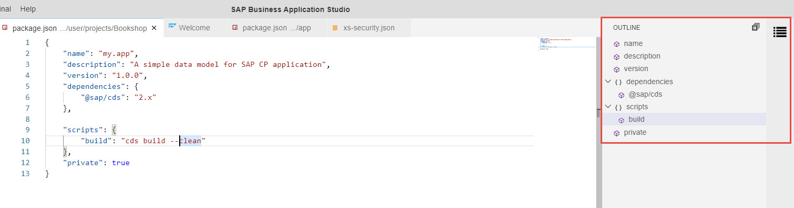

<!-- loio6e9a28028d4141e39f4d598e233bb74c -->

# Outline View

The Outline view displays a symbol tree of the currently active editor. This view is useful for understanding the structure of a file or for navigating to a specific element in a file.

You can click on an element in the Outline view to open that element in the editor tab.

To open the Outline view in SAP Business Application Studio, select *View* \> *Outline* from the menu bar.

The Outline view opens on the right side of the IDE.

