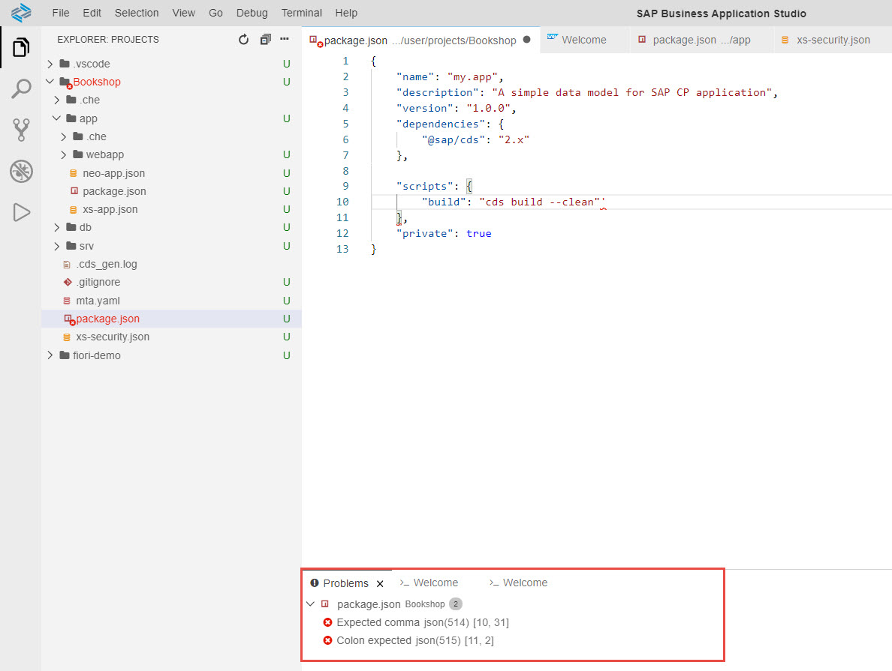

<!-- loiof5bd850ec2004307a4867286b135f405 -->

# Problems View

The Problems view displays the coding errors and warnings of all open files in a list. When you click an item from the list, the problematic piece of code is highlighted in the editor.

To open the Problems view in SAP Business Application Studio, select *View* \> *Problems* from the menu bar.

