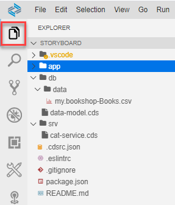
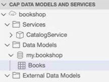

<!-- loio780ba0f7049248c782de1f7f66b8b391 -->

# Project Explorer

Use the project explorer to browse the contents of your current workspace.

On the left side of your screen, you find a quick bar to open the SAP Business Application Studio views.

The most important, is the *Explorer* view that displays the contents of your current workspace.

<a name="loio780ba0f7049248c782de1f7f66b8b391__section_acm_kpc_2qb"/>

## CAP DATA MODELS AND SERVICES

When working in a Full Stack Cloud Application dev space, you can use the *CAP DATA MODELS AND SERVICES* section to see a simplified structure of the project. It displays a hierarchical view of the main source units: UI, services, data modules, and external data modules.

From the *CAP DATA MODELS AND SERVICES* section, you can:

-   Create a data model: select the *Data Models* folder and click *Create a Data Model* from the context menu.
-   Create a service: select the *Services* folder and click *Create a Service* from the context menu.
-   Edit new or existing data models and services using the CDS Graphical Modeler: Open the CDS Graphical Modeler from the context menu of the relevant service or namespace.
-   Import sample data:

    1.  Select the desired data model entity and click *Import Sample Data* from the context menu.
    2.  Select the sample data file you want to import.
    The file is added to your project in the relevant folder using the proper naming format.

-   Open sample data: select the desired data model entity and click *Open Sample Data* from the context menu. The sample data file opens in the text editor.
-   Create an SAP Fiori elements application using the SAP Fiori application template wizard.
-   Consume an external service:
    1.  In the *CAP DATA MODELS AND SERVICES* section, select the *External Data Model* folder.
    2.  Right-click and select *Add an External Data Model*.

        The data model of the external service is presented on the canvas with a different color and can't be edited.

