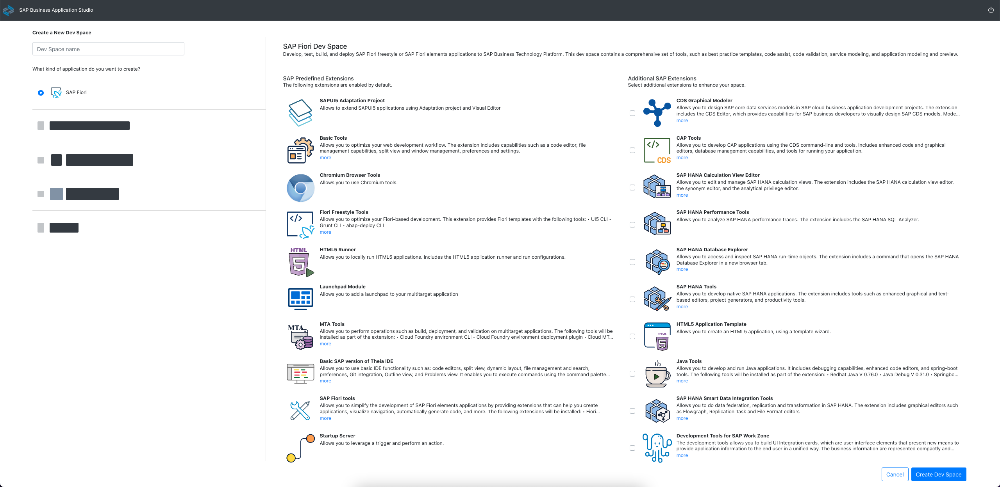

<!-- loio354f00cbdecf49e28084ac148a976386 -->

<!-- loio354f00cbdecf49e28084ac148a976386 -->

# SAP Fiori Dev Space

SAP Fiori Dev Space allows you to develop SAP Fiori applications based on various environments: Cloud Foundry, ABAP on-premise, and ABAP Cloud.

See, [Developing and Extending SAP Fiori Applications](https://help.sap.com/viewer/584e0bcbfd4a4aff91c815cefa0bce2d/Cloud/en-US) for more information.

## Pre-defined Scenario Extensions
Below you can see a list of pre-defined scenarios that can be used within the SAP Fiori Dev Space.
<table>
<tr>
<th valign="top">

Extension

</th>
<th valign="top">

Description

</th>
</tr>
<tr>
<td valign="top">

SAPUI5 Adaptation Project

</td>
<td valign="top">

Allows to leverage features of [SAPUI5 Flexibility](https://sapui5.hana.ondemand.com/#/topic/a8e55aa2f8bc4127923b20685a6d1621) and enables to adapt and extend SAPUI5 applications without changing the source code. S

See [Extending an SAP Fiori Application](https://help.sap.com/viewer/584e0bcbfd4a4aff91c815cefa0bce2d/Cloud/en-US/ada9567b767941aba8d49fdb4fdedea7.html).

</td>
</tr>
<tr>
<td valign="top">

Basic Tools

</td>
<td valign="top">

Allows you to optimize your web development workflow. The extension includes capabilities such as a code editor, file management capabilities, split view and window management, preferences and settings.

</td>
</tr>
<tr>
<td valign="top">

Chromium Browser Tools

</td>
<td valign="top">

Allows you to use Chromium tools.

</td>
</tr>
<tr>
<td valign="top">

Fiori Freestyle Tools

</td>
<td valign="top">

Allows you to optimize your Fiori-based development. This extension provides Fiori templates with the following tools:
- [UI5 CLI](https://sap.github.io/ui5-tooling/pages/CLI/)
- [Grunt CLI](https://gruntjs.com/using-the-cli)
- [abap-deploy CLI](https://www.npmjs.com/package/@sap/abap-deploy)

</td>
</tr>
<tr>
<td valign="top">

HTML5 Runner

</td>
<td valign="top">

Allows you to locally run HTML5 applications. Includes the HTML5 application runner and run configurations.

See [Create Run Configurations for HTML5 Applications](https://help.sap.com/viewer/0e2ec06ee34742fd9054fabe09c12d35/Cloud/en-US/a72ecc1d642f4621acb795e106227a7d.html).

</td>
</tr>
<tr>
<td valign="top">

Launchpad Module

</td>
<td valign="top">

Allows you to add a launchpad to your multitarget application.

See [Basic Development Flow in SAP Business Application Studio](https://help.sap.com/viewer/ad4b9f0b14b0458cad9bd27bf435637d/Cloud/en-US/c2e546cada9c4cc7a13f88dcea1c08cd.html).

</td>
</tr>
<tr>
<td valign="top">

MTA Tools

</td>
<td valign="top">

Allows you to perform operations such as build, deployment, and validation on multitarget applications. The following tools are installed as part of the extension:

-   Cloud Foundry environment CLI

-   Cloud Foundry environment deployment plugin

-   Cloud MTA Build Tool

-   MTA module runner \(VS Code extension\)

See [MTA Tools](https://help.sap.com/viewer/209802f55bfd47fcaccecf1241df99f8/Cloud/en-US).

</td>
</tr>
<tr>
<td valign="top">

Basic SAP version of Theia IDE

</td>
<td valign="top">

Allows you to use basic IDE functionality such as: code editors, split view, dynamic layout, file management and search, preferences, Git integration, Outline view, and Problems view.
It enables you to execute commands using the command palette and the terminal.
The following tool will be installed as part of the extension:
- Eclipse Theia
- Git

</td>
</tr>
<tr>
<td valign="top">

SAP Fiori tools

</td>
<td valign="top">

Allows you to simplify the development of SAP Fiori elements applications by providing extensions that can help you create applications, visualize navigation, automatically generate code, and more.
The following extensions will be installed:
- Fiori elements Yeoman Generator
- Application Modeler
- Guided Development
- Service Modeler
- XML Annotation Language Server

See [SAP Fiori tools](https://help.sap.com/viewer/product/SAP_FIORI_tools)
</td>
</tr>
<tr>
<td valign="top">

Startup Server

</td>
<td valign="top">

Allows you to leverage a trigger and perform an action.

</td>
</tr>
<tr>
<td valign="top">

Basic UI5 Template

</td>
<td valign="top">

Allows you to create a basic SAPUI5 application, using the Yeoman generator.

See [Yeoman Generator for OpenUI5/SAPUI5 projects](https://github.com/ui5-community/generator-ui5-project/)

</td>
</tr>
<tr>
<td valign="top">

UI5 Free Style Templates

</td>
<td valign="top">

Allows you to create an SAP Fiori worklist and master details applications, using the Yeoman generator.

See [Yeoman Generator for OpenUI5/SAPUI5 projects](https://github.com/ui5-community/generator-ui5-project/)

</td>
</tr>
<tr>
<td valign="top">

SAPUI5 Layout Editor

</td>
<td valign="top">

Allows you to visually develop your XML view.

See [Develop UI Using the Layout Editor](https://help.sap.com/viewer/584e0bcbfd4a4aff91c815cefa0bce2d/Cloud/en-US/0b54d2a8e4434f748de1819e7d66855f.html).

</td>
</tr>
</table>

## Additional Scenario Extensions
Additionaly to pre-defined extensions, you can select and instal the following extensions:

<table>
<tr>
<th valign="top">

Extension

</th>
<th valign="top">

Description

</th>
</tr>
<tr>
<td valign="top">

CDS Graphical Modeler

</td>
<td valign="top">

Allows you to design SAP core data service models in SAP Cloud Business Application development projects.

The extension includes the CDS Editor, which provides capabilities for SAP business developers to visually design SAP CDS models. Models include artifacts, such as entities, types, unstructured types, enums, arrayed types, events, associations and compositions, and projects and services, which accelerate SAP Cloud Business Application development.

See [Design CDS Models Using SAP Business Application Studio](https://help.sap.com/viewer/80d8499164f14d90bfd1cb11f961bb94/Cloud/en-US).

</td>
</tr>
<tr>
<td valign="top">

CAP Tools

</td>
<td valign="top">

Allows you to develop CAP applications using the CDS command-line and tools.
Includes enhanced code and graphical editors, database management capabilities, and tools for running your application.

See [CAP - Choose Your Preferred Tools - Business Application Studio](https://cap.cloud.sap/docs/tools/#bastudio).

</td>
</tr>
<tr>
<td valign="top">

SAP HANA Calculation View Editor

</td>
<td valign="top">

Allows you to edit and manage SAP HANA calculation views. The extension includes the SAP HANA calculation view editor, the synonym editor, and the analytical privilege editor.

See [SAP HANA - Working with SAP Business Application Studio](https://help.sap.com/viewer/c2b99f19e9264c4d9ae9221b22f6f589/LATEST/en-US/ebd3400f602c4d18bfc984b9af563781.html).

</td>
</tr>
<tr>
<td valign="top">

SAP HANA Performance Tools

</td>
<td valign="top">

Allows you to analyze SAP HANA performance traces. The extension includes the SAP HANA SQL Analyzer.

</td>
</tr>
<tr>
<td valign="top">

SAP HANA Database Explorer

</td>
<td valign="top">

Allows you to access and inspect SAP HANA run-time objects. The extension includes a command that opens the SAP HANA Database Explorer in a new browser tab.

See [SAP HANA Database Explorer](https://help.sap.com/viewer/a2cea64fa3ac4f90a52405d07600047b/cloud/en-US/7fa981c8f1b44196b243faeb4afb5793.html).

</td>
</tr>
<tr>
<td valign="top">

SAP HANA Tools

</td>
<td valign="top">

Allows you to develop native SAP HANA applications. The extension includes tools such as enhanced graphical and text-based editors, project generators, and productivity tools.

See [AP HANA Cloud, SAP HANA Database Developer Guide for Cloud Foundry Multitarget Applications (SAP Business App Studio)](https://help.sap.com/viewer/c2b99f19e9264c4d9ae9221b22f6f589/latest/en-US).

</td>
</tr>
<tr>
<td valign="top">

HTML5 Application Template

</td>
<td valign="top">

Allows you to create an HTML5 application, using a template wizard.

</td>
</tr>
<tr>
<td valign="top">

SAP HANA Smart Data Integration Tools

</td>
<td valign="top">

Allows you to do data federation, replication and transformation in SAP HANA. The extension includes graphical editors such as Flowgraph, Replication Task and File Format editors.

See [Modeling Guide for SAP Web IDE and SAP Business Application Studio](https://help.sap.com/viewer/cc7ebd3f344a4cdda20966a7617f52d8/latest/en-US/b72a6833d8d54aa2be4c199ac4db6996.html)

</td>
</tr>
<tr>
<td valign="top">

Development Tools for SAP Work Zone

</td>
<td valign="top">

The development tools allows you to build UI Integration cards, which are user interface elements that present new means to provide application information to the end user in a unified way. The business information are represented compactly and allows interaction on it being executed. This editor allows user to create new cards or build cards from available samples, edit card properties and preview the changes. Finally, users can bundle and deploy the cards into different systems.

See [What Is SAP Work Zone?](https://help.sap.com/viewer/b03c84105ff74f809631e494bd612e83/Cloud/en-US/5c0103b130de411fb2a4b5416e36d767.html)

</td>
</tr>
<tr>
<td valign="top">

SAP Business Application Studio Extension Development

</td>
<td valign="top">

Allows you to use create, deploy, and manage your own SAP Business Application Studio extensions.
You can then include these extensions in your SAP Business Application Studio environment.
The following tool will be installed as part of the extension:
- SAP Business Application Studio Extension Management CLI

</td>
</tr>
<tr>
<td valign="top">

Workflow Management

</td>
<td valign="top">

Allows you to create workflow applications and process templates with SAP Workflow service.

See [SAP Workflow Management - Development](https://help.sap.com/viewer/6f55baaf330443bd8132d071581bbae6/LATEST/en-US/eacebd4d0dac4f3b8ff68832dff54b8b.html).
</td>
</tr>
<tr>
<td valign="top">

Serverless Runtime Development Tools

</td>
<td valign="top">

Allows you to create and deploy extensions in a serverless environment.

See [SAP BTP, Serverless Runtime](https://help.sap.com/viewer/bf7b2ff68518427c85b30ac3184ad215/LATEST/en-US/e1934bfce7614872b682cae207444ef1.html).
</td>
</tr>
</table>

# Migration from SAP Web IDE
If you have projects that were created using SAP Web IDE, you can migrate them to SAP Business Application Studio.

See [Migrate an Application](https://help.sap.com/viewer/17d50220bcd848aa854c9c182d65b699/Latest/en-US/70d41f3ee29d453a90efab3ce025d450.html) in the *SAP Fiori tools Users Guide*.

# Other useful information
See the following topics for more information:
-   [Developing SAP Fiori applications with SAP Fiori tools](https://help.sap.com/viewer/17d50220bcd848aa854c9c182d65b699/Latest/en-US/f09752ebcf63473e9194ea29ca232e56.html)
-   [Developing an SAP Fiori Application for Cloud Foundry](https://help.sap.com/viewer/584e0bcbfd4a4aff91c815cefa0bce2d/Cloud/en-US/61c7416594984034a5676e63a6494ba1.html)
-   [Developing an SAP Fiori Application Based on an ABAP Cloud System Service](https://help.sap.com/viewer/584e0bcbfd4a4aff91c815cefa0bce2d/Cloud/en-US/21b20cde952e4016a078ddfb9190a1ec.html)
-   [Developing an SAP Fiori Application Based on an SAP S/4HANA System](https://help.sap.com/viewer/584e0bcbfd4a4aff91c815cefa0bce2d/Cloud/en-US/22f3401b2e464344943f2a6abf05d092.html)
-   [Developing an SAP Fiori Application for a CAP Project](https://help.sap.com/viewer/584e0bcbfd4a4aff91c815cefa0bce2d/Cloud/en-US/d12a1c8b6b71495c8e8a268974d8364b.html)
-   [SAP Cloud Portal service](https://help.sap.com/viewer/product/Portal_Service/1.0/en-US)
