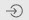
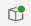

<!-- loio892114ce078b4e17a9ff7e751e6330cc -->

# SAP System Service Provider

The SAP System service provider includes systems from your SAP Business Application Studio subaccount. You can use the services as data sources in your application or for application development.

Login occurs automatically, using the SAP Business Application Studio user credentials.


<a name="loio892114ce078b4e17a9ff7e751e6330cc__section_fpr_sx3_qqb"/>

## Explore SAP System Services

1.  Click the gray arrow to display the SAP Business Application Studio subaccount's destinations \(SAP systems\).
2.  Click the system to see the system properties, including the name, description, URL, authentication type, and status.

    There are different types of systems displayed using the SAP Business Application Studio subaccount's destinations:

    -   ABAP Service Catalog

        The destination points to the ABAP system directly. The system shows its service catalogs with a list of services \(V2 and V4, for example\). To see the list of services, click  \(Open System Details\) and log in with your user credentials.

    -   Service Host

        The destination points to a host. To log in, add the service path.

    -   Service URL

        The destination points directly to the service.

    If you maintain credentials in the destination configuration of the account, log in can occur automatically. If a system is available, the icon has a green dot. \(\)

    If you don't maintain the credentials in the destination configuration of the account, you need to log in manually to open the system information.

3.  If needed, enter the service path to log in or click  \(Open System Details\) and log in with your user credentials.

    You can now see the system properties.

4.  Click the gray arrow to display the list of services.

    Click on a service to see its properties, including the service name, protocol, URL, status, and entity details.


<a name="loio892114ce078b4e17a9ff7e751e6330cc__section_dtd_wx3_qqb"/>

## Service Actions for Development

1.  You can create a project from a service within the system:
    1.  Click *Service Actions* \> *Create Project from Service*.

        The template wizard displays the projects that you can create from a service. For example, an HTML5 project or an SAP Fiori application. See [Create an HTML5 Project](https://help.sap.com/viewer/0e2ec06ee34742fd9054fabe09c12d35/Cloud/en-US/e46be902c7b54f9baaab1870ca553303.html) or [SAP Fiori Elements](https://help.sap.com/viewer/17d50220bcd848aa854c9c182d65b699/Latest/en-US/1488469a315c442fa116ab4449d4ad27.html) for more information.

    2.  Use the template wizard to create the relevant project.
2.  You can select a service from the Service Center and add it as an external data model to a CAP Node project:
    1.  Open a service and click *Service Actions* \> *Add Data Model to CAP Project*.
    2.  Select the target CAP Node project to add the data model to.
    3.  \(Optional\) You can generate a sample service and select the relevant entities.
        1.  Select *Add a Sample Service*.
        2.  Select the entities that you want to add.
    4.  Click *Add*.

        You added the data model to the CAP project. The following changes happen:

        -   The `<service_name>.xml` and `<service_name>.csn` files appear in the *srv* \> *external* folder of the project.
        -   A service section appears in the `package.json` file of the CAP project, which refers to the *srv* \> *external* \> *<service\_name\>.xml* file. This file has the metadata of the service:

            ```
            "<service_name>": {
              "kind": "odata",
              "model": "srv/external/<service_name>"
              "credentials": {
                "destination": "<service_name>"
              }
            }
            ```

        If you added a sample service with the relevant entities, the `<service_name>.cds` and the `<service_name>.js` files appear in the *srv* \> *external* folder of the CAP project.


<a name="loio892114ce078b4e17a9ff7e751e6330cc__section_n2k_zx3_qqb"/>

## Add a System

You can add a new system to your SAP Business Application Studio subaccount:

> ### Note:  
> If you're using a nontrial account, make sure that you have the *Business\_Application\_Studio\_Administrator*[Manage Authorizations](https://help.sap.com/viewer/9d1db9835307451daa8c930fbd9ab264/Cloud/en-US/01e69c53003c4b0a8a64310a3f08867d.html).

1.  Hover over the subaccount and click  \(Add system\).

    A new tab opens. role assigned to you in the cockpit. See

2.  Enter the system name and URL and select the system type, proxy, authentication method, and product.

    > ### Note:  
    > You can select *Basic Authentication* and enter the username and password for your system. This configuration enables you to view the system information without needing to log in each time.


