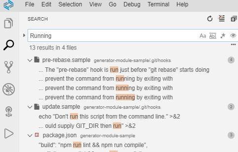
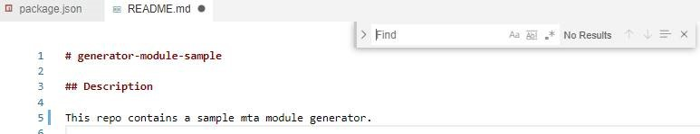
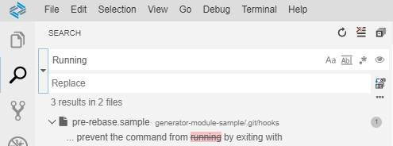
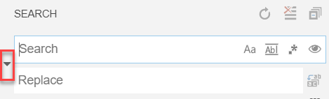

<!-- loio1d57a704e60a4c42893806137f2b378b -->

# Search

There are different Search capabilities in SAP Business Application Studio.

You can perform a search from the Search view or from the Find widget in the editor.

-   To open the Search view, select *View* \> *Search*.

    

-   To open the Find widget, press ***Ctrl+F***.

    

**Find and Replace**

You can find text and replace in the currently opened file. The search results will be highlighted in the editor, overview ruler, and minimap.

If there is more than one matched result in the current opened file, you can press ***Enter*** and ***Shift+Enter*** to navigate to next or previous result when the find input box is focused.

When the Find Widget is open, it will automatically populate the selected text in the editor into the find input box. If the selection is empty, the word under the cursor will be inserted into the input box instead.

**Find In Selection**

By default, the find operations are run on the entire file in the editor. It can also be run on selected text. You can turn this feature on by clicking the hamburger icon on the Find Widget.

**Multiline support**

You can search text in multiple lines by pasting it into the *Find* input box. Pressing ***Ctrl+Enter*** inserts a new line in the input box.

**Resize Find Widget**

You can drag the left sash of the Find Widget to enlarge it. You can also double-click the left sash to maximize it or shrink it to its default size.

**Search across files**

You can search over all files in the currently opened folder. Press ***Ctrl+Shift+F*** and enter your search term. Search results are grouped into files containing the search term, with an indication of the hits in each file and its location. Expand a file to see a preview of all of the hits within that file. Then single-click on one of the hits to view it in the editor.

**Advanced search options**

In the input box below the search box, you can enter patterns to include or exclude from the search.

If you enter a word, a search will be performed on every folder and file with the name of the word you entered in the workspace.

If you enter ***./*** before the word, that will match the folder name at the top level of your workspace.

Use an exclamation mark ***!*** to exclude those patterns from the search.

Use a comma ***,*** to separate multiple patterns.

Paths must use forward slashes.

You can also use glob syntax:

-   ***\**** to match one or more characters in a path segment

-   ***?*** to match on one character in a path segment

-   ***\*\**** to match any number of path segments, including none

-   ***\{\}*** to group conditions \(for example ***\{\*\*/\*.html,\*\*/\*.txt\}*** matches all HTML and text files\)

-   ***\[\]*** to declare a range of characters to match

Some folders are excluded by default to reduce the number of search results that you are not interested in \(for example, `node_modules`\). Open settings to change these rules.

Also note the Use Exclude Settings and Ignore Files toggle button in the files to exclude box. The toggle determines whether to exclude files that are ignored by your `.gitignore` files and/or matched by your `files.exclude` and `search.exclude` settings.

From the Explorer, you can right-click on a folder and select Find in Folder to search inside a folder only.

**Search and replace**

You can search and replace across files. Expand the Search input field to display the Replace one.

When you type text into the Replace input field, you will see a diff display of the pending changes. You can replace across all files from the Replace input field, replace all in one file or replace a single change.

**Advanced Search and Replace Options**

In addition to search and replace with plain text, there are also advanced search options:

-   Match Case

-   Match Whole Word

-   Regular Expression

-   Include Ignored Files

