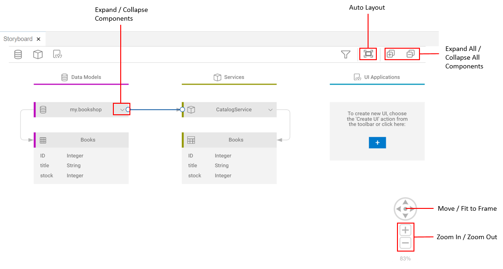
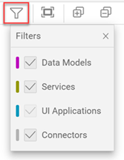

<!-- loio93b6d57bc9744191915ec8d9217bf23d -->

# Storyboard

The Storyboard, together with the project explorer for CAP, helps you to develop large parts of your CAP application using modeling and graphical editors.

To open the Storyboard, select your project in the *CAP DATA MODELS AND SERVICES* section, and click *Open with Storyboard* from the context menu.

## Using the Graphical Editor

The Storyboard allows you to develop using graphical editors and wizards.

It provides a graphical view of the data models, services, and UI front ends of the application, as well as the connections between them. This allows for a quick understanding of the application’s structure and components.

You can move, zoom in and out, and expand and collapse single objects or all objects at once.

You can also filter objects to focus on the application components that are relevant for you.

<a name="loio93b6d57bc9744191915ec8d9217bf23d__section_knm_nnd_44b"/>

## Creating a Data Model or a Service

-   From the Storyboard toolbar, click the *Create a data model* icon \(\), or in the *CAP DATA MODELS AND SERVICES* section, select the *Data Models* folder and click *Create a Data Model* from the context menu.

-   From the Storyboard toolbar, click the *Create a service* icon \(\), or in the *CAP DATA MODELS AND SERVICES* section, select the *Services* folder and click *Create a Service* from the context menu.

<a name="loio93b6d57bc9744191915ec8d9217bf23d__section_tmn_snd_44b"/>

## Editing a Data Model or a Service

You can edit new or existing data models and services using the CDS Graphical Modeler.

Open the CDS Graphical Modeler from the context menu of the relevant service or namespace in the *CAP DATA MODELS AND SERVICES* section, or click the Edit icon  next to desired element in the Storyboard.

For information about the CDS Graphical Modeler, see [Design CDS Models Using SAP Business Application Studio](https://help.sap.com/viewer/80d8499164f14d90bfd1cb11f961bb94/Cloud/en-US).

<a name="loio93b6d57bc9744191915ec8d9217bf23d__section_ix1_xnd_44b"/>

## Creating an SAP Fiori Elements UI

You can create an SAP Fiori elements application using the SAP Fiori application template wizard. Open it from the toolbar \(\) or from the *CAP DATA MODELS AND SERVICES* section.

<a name="loio93b6d57bc9744191915ec8d9217bf23d__section_usc_xnd_44b"/>

## Consuming External Services

1.  In the *CAP DATA MODELS AND SERVICES* section, select the External Data Model folder.
2.  Right-click and select *Add an External Data Model*.

The data model of the external service is presented on the canvas with a different color and cannot be edited.

