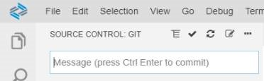
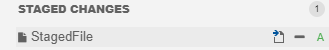
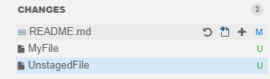

<!-- loiod14646ada3a24483b5a47265a8242140 -->

# Understanding the UI

SAP Business Application Studio provides a graphical user interface for executing Git commands and managing your source control and versioning.

<a name="loiod14646ada3a24483b5a47265a8242140__section_svy_5cn_23b"/>

## Understanding the UI

The Git view consists of three major sections. The top section is for authoring the commit messages. It also provides access to a couple of basic Git commands.

Below this, you find the commit section, which lists the changed files by their name and separates them in two groups:

-   *STAGED CHANGES* - A list of the files that have been staged. Click  to open the selected file, or  to unstage it.

    

-   *CHANGES* - Files listed under the *CHANGES* section contain unstaged changes. Each file name is followed by a path to its parent directory and an indicator describing the status of the change.

    Click  to open the selected file,  to stage the file, or  to refresh it.

     

The files can be in any of the following statuses:

-   *A* - A new file that has been staged.
-   *U* - An unstaged file. An unstaged change can be reverted by clicking on the *Discard Changes* action next to the file location.
-   *M* - A modified file. Double-clicking on a modified file will open it in a diff editor. The read-only editor on the left-hand side shows the state from the index. The right-hand side of the editor reflects the state of the working tree, and it lets you to further modify the file.
-   *C* - A copied file \(if blue\) or a conflicted file \(if red\).
-   *D* - A deleted file.

At the bottom of the Git view you can see the last commit section, where a description of the most recent commit is displayed.

After staging the desired files and specifying the commit message, the changes can be committed to the repository. After a successful commit, the Last Commit section is automatically updated.

