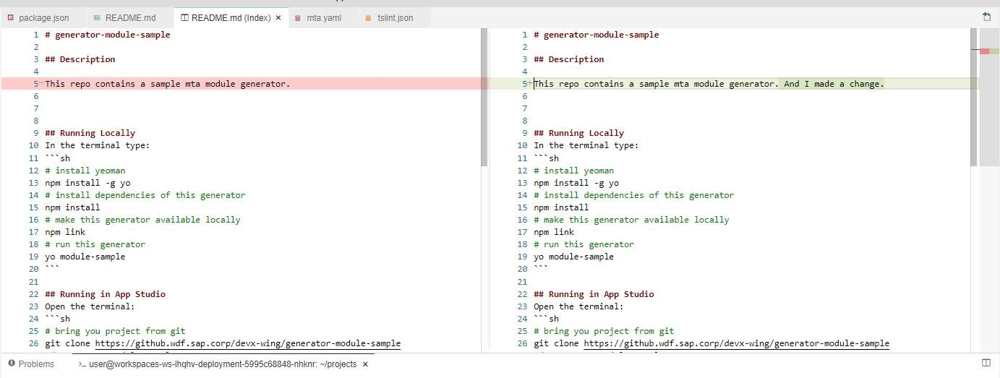

<!-- loio11f5b00eb32e465fb6c389ffae9cdbd3 -->

# View Diffs

Compare different versions of a file.

<a name="loio11f5b00eb32e465fb6c389ffae9cdbd3__section_cgv_by1_g4b"/>

## View Changes in Local Repository

Clicking a modified file opens a diff viewer. Its left-hand side is a read-only editor showing the index state, and the right-hand side is an editor for the working-tree state.

<a name="loio11f5b00eb32e465fb6c389ffae9cdbd3__section_llm_fy1_g4b"/>

## View Changes in Different Branches

1.  Select a modified file from the task explorer.
2.  From the command palette, enter ***Git Diff: Compare With***.
3.  Select the branch to which you want to compare the currently active branch.

A diff viewer is displayed. Its left-hand side is a read-only editor showing the current branch, and the right-hand side shows the file in the selected branch.

