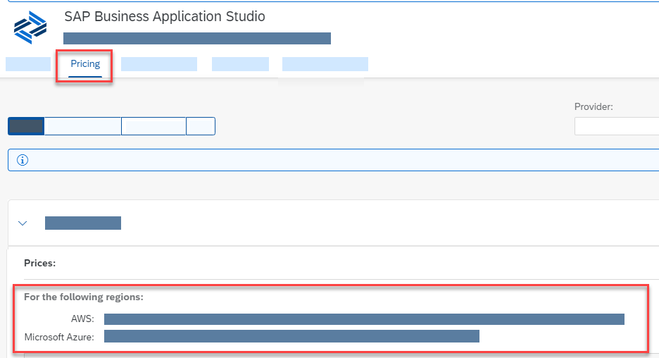

<!-- loio8f46c6e6f86641cc900871c903761fd4 -->

# What is SAP Business Application Studio?

SAP Business Application Studio is a new SAP Business Technology Platform \(BTP\) service that offers a modern development environment tailored for efficient development of business applications for the SAP Intelligent Enterprise.

SAP Business Application Studio is based on an open source IDE, Eclipse Theia, which embraces the Microsoft Visual Studio Code experience. Available as a cloud service, SAP Business Application Studio provides a desktop-like experience similar to leading IDEs, with command line and optimized editors. At the heart of SAP Business Application Studio are the dev spaces. The dev spaces are comparable to isolated virtual machines in the cloud containing tailored tools and preinstalled runtimes per business scenario, such as SAP Fiori, SAP S/4HANA extensions, Workflow, Mobile and more. This simplifies and saves time in setting up your development environment and allows you to efficiently develop, test, build, and run your solution locally or in the cloud.

<a name="loio8f46c6e6f86641cc900871c903761fd4__section_v5w_5jm_wjb"/>

## Scenarios

SAP Business Application Studio provides a tailor-made development environment for various development scenarios, such as SAP Fiori, SAP S/4HANA extension, and Workflow. With each of these scenarios, you can create different types of applications.

In the [Dev Space Types](Dev_Space_Types_4142f78.md) section, you can learn about each scenario.

<a name="loio8f46c6e6f86641cc900871c903761fd4__section_x1k_xjm_wjb"/>

## Capabilities

In SAP Business Application Studio, you are provided with one or more dev spaces. A dev space is a development environment with all the tools, capabilities, and resources needed for developing your application. Each type of application requires a different development environment. Based on the type of application that you choose to build, you're provided with a different set of tools. You can add additional tools to supplement the application with additional extensions for the scenario.

The dev space is an isolated development environment providing a local-like development experience. Among other tools, it provides terminal access to the file system so you can run various commands, you can test-run your application in the dev space itself without deploying to the target runtime \(Cloud Foundry\), almost as if you were working on your own desktop.

Unlike other desktop IDEs, SAP Business Application Studio is equipped with various tools specially built for developing business applications in the SAP ecosystem.

These tools cover the end-to-end development cycle:

-   Clone an existing project with a Git client or create new project using templates.

-   Use editors for SAP-specific technologies.

-   Easily test your application on your dev space while consuming services from remote sources.

-   Build and deploy the application as a multitarget application \(MTA\).

<a name="loio8f46c6e6f86641cc900871c903761fd4__section_rvc_kxq_mlb"/>

## Availability

The following browsers are supported for working in SAP Business Application Studio. Additional browsers will be added over time.

> ### Note:  
> Unless specifically stated, only the latest browser version is supported.

-   Mozilla Firefox

-   Google Chrome

-   Microsoft Edge

You can find the regions where SAP Business Application Studio is available in the *Pricing* tab of the [Discovery Center](https://discovery-center.cloud.sap/#/serviceCatalog/business-application-studio?region=all&tab=service_plan&licenseModel=cpea).

