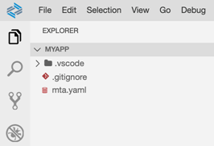
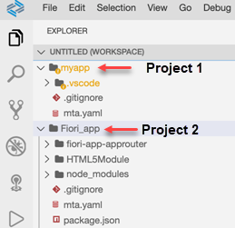

<!-- loio0919ce1ca4a342628e49c0f5e9c8cdcf -->

# Workspaces in SAP Business Application Studio

Your workspace is an entity containing your project's settings, debug configurations, and task configurations.

In SAP Business Application Studio, a workspace is created for you as part of the Project Creation wizard.

You can choose to create a new workspace or for each project, or you can set up a multi-root environment.

It is important to work with your project under the root or in multi-root mode and refrain from opening a parent folder because:

-   Many extensions use the workspace root as the point of reference to project artifacts. For example, some extensions look for the `package.json` in the root only.

-   In some cases, code completion \(and other language services\) might point you incorrectly to resources from different projects, as the language extension does not understand that there are two different projects under same root.

-   The Git view can only target one folder at a time, so the user needs to constantly change the Git view target if there are different projects.

-   The `.vscode` folder can be part of the source control, so run configurations, tasks, and settings can be saved to Git and be managed per project.

-   Deletion of the project will delete all of its resources \(tasks, launch, settings\) and not only those under the project folder.

-   Third-party extensions may not work properly if the workspace is not set up as multi-root or only a project per workspace.

<a name="loio0919ce1ca4a342628e49c0f5e9c8cdcf__section_vxm_hkd_4nb"/>

## Workspace Per Project

We recommend you work in an environment where each project resides in a single workspace.

In this case, the project is the root in the file explorer.

**To set a project as root:**

1.  Create your project following the wizard steps.
2.  Upon completion of the wizard, you are asked to open the project in a new workspace or to add it to an existing workspace. Click *Open in New Workspace*.

> ### Note:  
> When you generate your first project, this option is selected by default.

<a name="loio0919ce1ca4a342628e49c0f5e9c8cdcf__section_ucq_hkd_4nb"/>

## Working in a Multi-Root Environment

You can choose to have multiple projects residing in a multi-root workspace. In this case, each project is a root in the workspace.

There is a `.vscode` folder for each project, and the developer can view more than one project at a time in the workspace.

In multi-root you can save the settings, launch and task configuration per workspace so that they affect all projects within it.

### Creating a Multi-Root Environment

To set a project as multi-root:

1.  Create the project following the wizard steps.

2.  Upon completion of the wizard, you are asked to open the project in a new workspace or to add it to an existing workspace. Click *Add to Workspace*.

### Adding Folders Manually

If you want to add folders manually to your workspace:

1.  In the file explorer, click the workspace's More Actions icon.

     

2.  Click *Add Folder to Workspace*.
3.  Select the relevant folder.
4.  Click *Open*.

You can also add folders to a workspace using the *Git: Clone* command from the Command Palette.

### Adding Files Manually

If you want to add files manually to your workspace:

1.  Select the folder to which you want to add the file.
2.  Click the workspace's More Actions icon.

     

3.  Click *New File*.
4.  Enter the name of the file you want to add.
5.  Click *OK*.

### Changing Workspace Location

To move your workspace file to a new location:

1.  From the *File* menu, select *Save Workspace As*.
2.  Select the desired workspace location.
3.  Provide a name for the workspace.
4.  Click *Save*. All folder paths will be automatically set to the correct paths relative to the new workspace location.

### Reopening a Workspace

If you already have a workspace in which you want to create your project, click *Open Workspace* in the file explorer or from the *File* menu, and select the desired workspace file.

