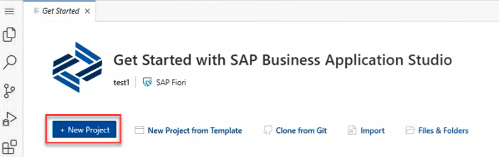
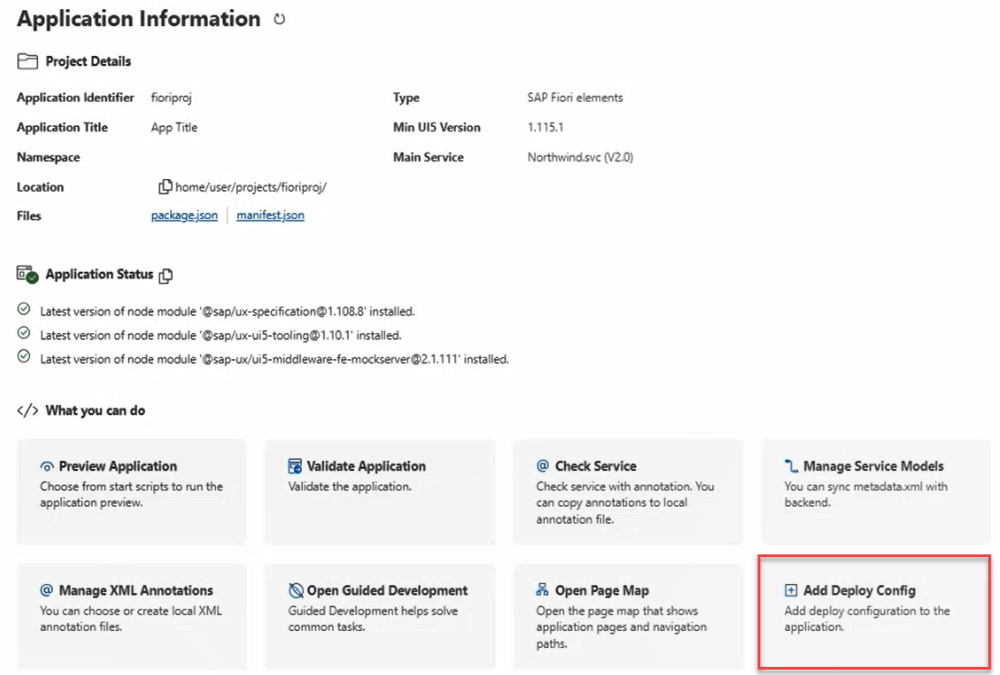

<!-- loio45d3789ec1534915a985ea175179f564 -->

# Accelerate Development Using Productivity Tools

Creation to deployment flow of a project using productivity tools.

<a name="loio45d3789ec1534915a985ea175179f564__section_stp_gvg_1yb"/>

## Creating a Project

1.  Create an SAP Fiori dev space. SAP Business Application Studio opens showing the *Get Started* page.

2.  Click *Create New Project*.

    

3.  In the command palette, provide a name for the project. The project entry appears in the project explorer and the storyboard opens at the side.
4.  Click the *External Resources* tile to add a service to the project. The *Service Center* view opens.
5.  Click on the service you want to add. The service page opens.
6.  Click *Service Actions* and then select*Add External Data Model to Fiori Project*.
7.  In the storyboard, click the *UI Applications* tile to add a new UI application to the project. The *Template* wizard opens.
8.  Select the template you want to create your UI and follow the wizard steps.

    Your project is created and appears in the project explorer on the left side of the page.

9.  Run your project.

<a name="loio45d3789ec1534915a985ea175179f564__section_o52_rph_1yb"/>

## Deploying the Project

1.  Open the *Application Information* tab.

2.  Under *What you can do*, select *Add Deploy Config*.

    

