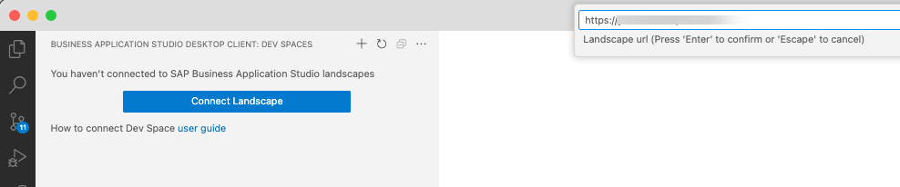
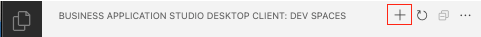
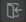
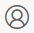
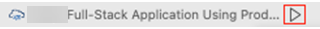
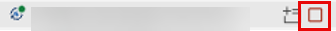
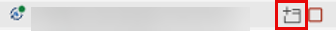
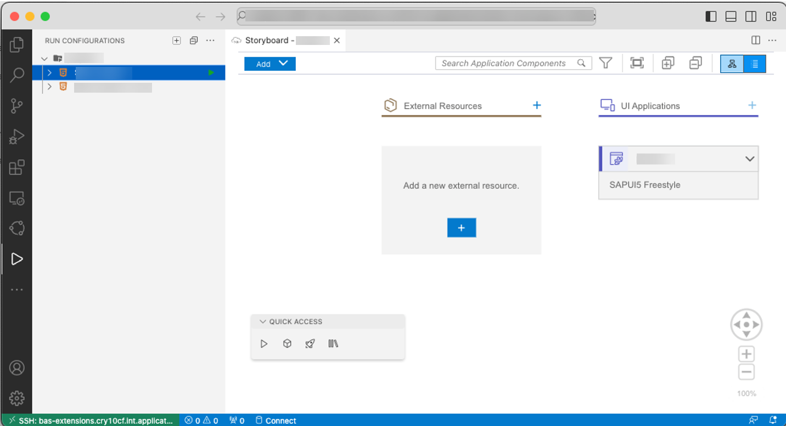

<!-- loio6b18cc8329b54bff9bccf82c2b60f445 -->

# Access SAP Business Application Studio from VS Code

Connect securely to SAP Business Application Studio dev spaces directly from a local Visual Studio Code desktop application.

**Prerequisites**

Make sure you have installed the [SAP Business Application Studio toolkit](https://marketplace.visualstudio.com/items?itemName=SAPOSS.app-studio-toolkit) extension.

To ensure the best functionality, make sure you are always working \(locally\) on the latest officially released version of VS Code and that you regularly update the [SAP Business Application Studio toolkit](https://marketplace.visualstudio.com/items?itemName=SAPOSS.app-studio-toolkit) extension to the latest version in the VS Code marketplace.

The remote connection to SAP Business Application Studio allows you to:

-   Work in your SAP Business Application Studio tailored dev spaces directly from your local VS Code installation, including the tools and configurations that are not available on your local OS.
-   Connect to your different centrally managed SAP environments \(for example, API Business Hub Enterprise, subaccount destinations, etc.\) via the SAP Business Application Studio Service Center.
-   Develop directly on SAP BTP.
-   Separate your development environment to avoid impacting your local machine configuration.
-   Access an existing dev space from multiple machines or locations.
-   Access multiple dev spaces from one VS Code desktop installation.
-   Debug an application running somewhere else, such as a customer site or in the cloud.
-   Use the extensions available in the VS Code marketplace.

    > ### Caution:  
    > If you install third-party extensions while using a remote connection to SAP Business Application Studio, the third party may be able to access your data from the dev space.

-   Allows easy access through a hosted secure environment, available anywhere, anytime.

<a name="loio6b18cc8329b54bff9bccf82c2b60f445__section_ov5_fkf_qxb"/>

## Getting Started

1.  Install the [SAP Business Application Studio toolkit](https://marketplace.visualstudio.com/items?itemName=SAPOSS.app-studio-toolkit) extension from the Visual Studio marketplace. This extension pack will automatically install the **Remote Access for SAP Business Application Studio** extension as well.
2.  Click  in the VS Code activity bar to open the **SAP Business Application Studio** view.

<a name="loio6b18cc8329b54bff9bccf82c2b60f445__section_ovq_fjf_qxb"/>

## Adding Landscapes

1.  In the *SAP Business Application Studio* view, click *Connect Landscape* to add the landscape you want to access.

    

2.  In the command palette, enter your landscape URL.

**To add another landscape:**

1.  Click  in the view's title bar.

    

2.  In the command palette, enter the additional landscape URL.

All the landscapes you connect to and their respective dev spaces are displayed in the **SAP Business Application Studio** view.

> ### Note:  
> Closing this window will log you out of all the landscapes.

<a name="loio6b18cc8329b54bff9bccf82c2b60f445__section_c4p_z3w_pxb"/>

## Connecting to the Landscapes

1.  Select the landscape to which you want to log in.
2.  Click .
3.  When prompted, allow the extension to log in using SAP Business Application Studio.
4.  Click *Open* to allow access to the SAP Business Application Studio landscape in VS Code.
5.  If you are not already logged in, provide your SAP credentials when prompted.
6.  Click *Open VS Code* to start working on your SAP Business Application Studio dev spaces in VS Code.

<a name="loio6b18cc8329b54bff9bccf82c2b60f445__section_tcg_qjs_sxb"/>

## Disconnecting from the Landscapes

1.  From the action bar, click .
2.  Select *BAS Access Token \(Business Application Studio\)*.
3.  Click *Sign Out*.

<a name="loio6b18cc8329b54bff9bccf82c2b60f445__section_nc4_32x_pxb"/>

## Managing Dev Spaces

The **SAP Business Application Studio** view contains all the landscapes you added. You can access all the dev spaces in the landscapes to which you are connected.

-   Start a dev space by hovering over the dev space name and clicking Play.

    

    A dot appears on the dev space's icon once the status changes to STARTED.

    

-   Stop a dev space by hovering over the dev space name and clicking Stop.

    

-   Open a dev space by hovering over the dev space name and clicking .

    

    > ### Note:  
    > You can only have 2 dev spaces running at a time.

The dev space opens in a new tab.

