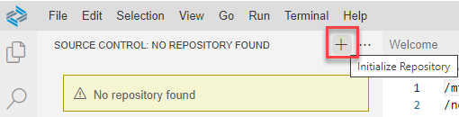
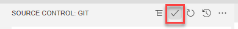

<!-- loio0930e56885944a2dbef1bc98ac12b4f0 -->

# Adding an Existing Project Using Git Remote

You can add an existing project to your Git Remote so that you can continue working on it in SAP Business Application Studio.

1.  In the Project Explorer, select you project.
2.  Click  from the left side-menu to open the Git view.
3.  Click  to initialize the local repository.

    

4.  Click  in the *CHANGES* section to add the files in your new local repository. This stages them for the first commit.

    

5.  Click  \(or press  [<Ctrl\>\] + [<Enter\>\] \) to commit the files that you've staged in your local repository.

    

6.  When prompted, provide a commit message.
7.  Click  to see more available actions.
8.  Select *Remote* \> *Add Remote*.
9.  When prompted, add the URL for the remote repository where your local repository will be pushed.
10. Push the changes in your local repository to the remote Git repository. See [Push Changes](push-changes-c1d3584.md).

