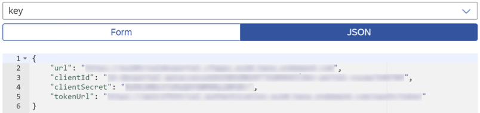

<!-- loio328519b3b7c04871b63a41350190d4d5 -->

# API Business Hub Enterprise Service Provider

The API Business Hub Enterprise service provider offers products and services that are published in the API Business Hub Enterprise. You can publish services and group them under the product that you'll consume.

**Prerequisite**

You created a service instance in the API Business Hub Enterprise. See [Creating a Service Instance in the API Management, API business hub enterprise](https://help.sap.com/docs/SAP_CLOUD_PLATFORM_API_MANAGEMENT/66d066d903c2473f81ec33acfe2ccdb4/dabee6e347f645a6805ec5b29f5d578c.html?locale=en-US#creating-a-service-instance-in-the-api-management%2C-api-business-hub-enterprise-).


<a name="loio328519b3b7c04871b63a41350190d4d5__section_n2k_zx3_qqb"/>

## Add a System

You can add a new system, referring to the API Business Hub Enterprise instance, from the SAP BTP cockpit in the SAP Business Application Studio subaccount. This destination will be used **to register new developers to API Business Hub Enterprise and to subscribe them to products**.

> ### Note:  
> To add a system, you must meet these criteria:
> 
> -   You're assigned the *Business\_Application\_Studio\_Administrator* role in the cockpit. See [Manage Authorizations and Roles](manage-authorizations-and-roles-01e69c5.md).
> -   You're connected to a space with a subscription to the API Business Hub Enterprise.

1.  Hover over the subaccount and click  \(Add system\).

    A new tab opens.

2.  Enter the system name and URL and select the system type, proxy, authentication method, and product.

    > ### Note:  
    > You can select *Basic Authentication* and enter the username and password for your system. This configuration enables you to view the system information without needing to log in each time.

3.  Click *Add*.

1.  Create a destination in your SAP Business Application Studio subaccount from the cockpit with the following fields:


    <table>
    <tr>
    <th valign="top">

    Property


    
    </th>
    <th valign="top">

    Value


    
    </th>
    </tr>
    <tr>
    <td valign="top">

    *Name*


    
    </td>
    <td valign="top">

    Provide a name for the system.


    
    </td>
    </tr>
    <tr>
    <td valign="top">

    *Type*


    
    </td>
    <td valign="top">

    *HTTP*


    
    </td>
    </tr>
    <tr>
    <td valign="top">

    *URL*


    
    </td>
    <td valign="top">

    Use the `url` value from the service key of the API Business Hub Enterprise instance.

    You can find the service key for the service instance that you created \(in the Prerequisite\) in the SAP BTP cockpit, under the *API Management, API Business Hub Enterprise* service.

    


    
    </td>
    </tr>
    <tr>
    <td valign="top">

    *Proxy Type*


    
    </td>
    <td valign="top">

    *Internet*


    
    </td>
    </tr>
    <tr>
    <td valign="top">

    *Authentication*


    
    </td>
    <td valign="top">

    *OAuth2ClientCredentials*


    
    </td>
    </tr>
    <tr>
    <td valign="top">

    *Client ID*


    
    </td>
    <td valign="top">

    Use the `clientId` value from the service key of the API Business Hub Enterprise instance.


    
    </td>
    </tr>
    <tr>
    <td valign="top">

    *Client Secret*


    
    </td>
    <td valign="top">

    Use the `clientSecret` value from the service key of the API Business Hub Enterprise instance.


    
    </td>
    </tr>
    <tr>
    <td valign="top">

    *Token Service URL*


    
    </td>
    <td valign="top">

    Use the `tokenUrl` value from the service key of the API Business Hub Enterprise instance.


    
    </td>
    </tr>
    </table>
    
2.  In the *Additional Properties* section, configure the following:


    <table>
    <tr>
    <th valign="top">

    Property


    
    </th>
    <th valign="top">

    Value


    
    </th>
    </tr>
    <tr>
    <td valign="top">

    *HTML5.DynamicDestination*


    
    </td>
    <td valign="top">

    ***true***


    
    </td>
    </tr>
    <tr>
    <td valign="top">

    *WebIDEEnabled*


    
    </td>
    <td valign="top">

    ***true***


    
    </td>
    </tr>
    <tr>
    <td valign="top">

    *WebIDEUsage*


    
    </td>
    <td valign="top">

    ***apihub\_enterprise***


    
    </td>
    </tr>
    <tr>
    <td valign="top">

    *apiBusinessHubEnterpriseURL*


    
    </td>
    <td valign="top">

    Adding this property is optional.

    This property enables navigation from the Service Center to the API Business Hub Enterprise.

    Use the following format:

    <subscribed subaccount name\>.<devportal\_url\>.cfapps.<region\>.hana.ondemand.com

    Replace the placeholders with the following information:


    <table>
    <tr>
    <th valign="top">

    Property


    
    </th>
    <th valign="top">

    Value


    
    </th>
    </tr>
    <tr>
    <td valign="top">

    subscribed subaccount name


    
    </td>
    <td valign="top">

    Use the first part of the `tokenUrl` from the destination system of API Business Hub Enterprise.

    For example, if the URL is https://abcd123trial.authentication.eu10.hana.ondemand.com/oauth/token

    Use **abcd123trial** for the subscribed subaccount name.


    
    </td>
    </tr>
    <tr>
    <td valign="top">

    devportal\_url


    
    </td>
    <td valign="top">

    -   For trial, use **integrationsuitetrial-devportal**
    -   For production, use **apibhubenterprise**


    
    </td>
    </tr>
    <tr>
    <td valign="top">

    region


    
    </td>
    <td valign="top">

    Find it in the `tokenUrl`.

    For example, if the `tokenUrl` is https://abcd123trial.authentication.eu10.hana.ondemand.com/oauth/token

    The region is **eu10**.


    
    </td>
    </tr>
    </table>
    

    
    </td>
    </tr>
    </table>
    


<a name="loio328519b3b7c04871b63a41350190d4d5__section_fpr_sx3_qqb"/>

## Explore API Business Hub Enterprise Services

> ### Note:  
> The Service Center only shows API Business Hub Enterprise systems and products with OData services.

1.  From the Service Center, click the gray arrow to display the API Business Hub Enterprise systems.

    Each system points to an API Business Hub Enterprise instance.

2.  Click the gray arrow next to the system \(\) to display the products within it.

    Multiple APIs are grouped into a product.

3.  Click the gray arrow next to the products \(\) to display the services \(APIs\).

    If the product is available, the icon has a green dot \(\).

4.  Click a service \(\) to see its properties, including the service name, protocol, and status.

    To see the service details, you must be onboarded to the API Business Hub Enterprise and subscribed to the selected product:

    -   If you aren't onboarded to the API Business Hub Enterprise, enter your first name, last name, and subscription name and click *Subscribe*.

        You're now subscribed to the product and all services associated with it.

    -   If you're onboarded to the API Business Hub Enterprise, but you aren't subscribed to the product, enter a subscription name and click *Subscribe*.

        You can now access the service.


    After you're subscribed to the selected product, you'll see the following information:

    -   Subscription details

        This section includes a link to the product in the API Business Hub Enterprise, the subscription name with a link to the subscription in the API Business Hub Enterprise, and the subscription date.

    -   Service properties

        This section includes the service name, protocol, and status.


    If a service is available, the icon has a green dot \(\).

5.  Click an entity to see the service details, including entity data and preview the data:
    1.  You can see the entity's data from the *Entity Details* tab.
    2.  You can preview the entity's data from the *Preview Data* tab.

        This helps you choose an entity for your application.

        > ### Note:  
        > The preview only displays:
        > 
        > -   Up to 20 rows of data
        > -   Data for simple data types


<a name="loio328519b3b7c04871b63a41350190d4d5__section_dtd_wx3_qqb"/>

## Service Actions for Development

If the SAP Business Application Studio Administrator role is assigned to you, after creating a project or adding a data model, the destination to the selected product subscription is generated in the SAP BTP cockpit. The destination enables you to preview live data and run your deployed application. The destination includes information about the product subscription, including the subscription's API key and the subscription's ID.

If you don’t have the SAP Business Application Studio Administrator role, the destination isn't generated with your subscription. Without a destination, you can’t preview a project with live data and you can’t run your deployed application to Cloud Foundry.


### Create a Project from a Service

1.  Click *Service Actions* \> *Create Project from Service*.

    The template wizard displays the projects that you can create from a service. For example, an HTML5 project or an SAP Fiori application. See [Create an HTML5 Project](https://help.sap.com/viewer/0e2ec06ee34742fd9054fabe09c12d35/Cloud/en-US/e46be902c7b54f9baaab1870ca553303.html) or [SAP Fiori Elements](https://help.sap.com/viewer/17d50220bcd848aa854c9c182d65b699/Latest/en-US/1488469a315c442fa116ab4449d4ad27.html) for more information.

2.  Use the template wizard to create the relevant project.


### Add a Data Model to a CAP Project

You can select a service from the Service Center and add it as an external data model to a CAP Node project:

1.  Open a service and click *Service Actions* \> *Add Data Model to CAP Project*.
2.  Select the target CAP Node project to add the data model to.
3.  \(Optional\) You can generate a sample service and select the relevant entities.
    1.  Select *Yes* to add a sample service.
    2.  Select the entities that you want to add.

4.  Click *Add*.

    You added the data model to the CAP project. The following changes happen:

    -   The `<service_name>.xml` and `<service_name>.cds` files appear in the *srv* \> *external* folder of the project.
    -   A service section appears in the `package.json` file of the CAP project, which refers to the *srv* \> *external* \> *<service\_name\>.xml* file. This file has the metadata of the service:

        ```
        "<service_name>": {
          "kind": "odata",
          "model": "srv/external/<service_name>",
          "[production]": {
          "credentials": {
            "destination": "<service_name>",
            "path": "<service_path>"
          }
        }
        ```

    -   If you added a sample service with the relevant entities, the `<service_name>.cds` and the `<service_name>.js` files appear in the *srv* \> *external* folder of the CAP project.


