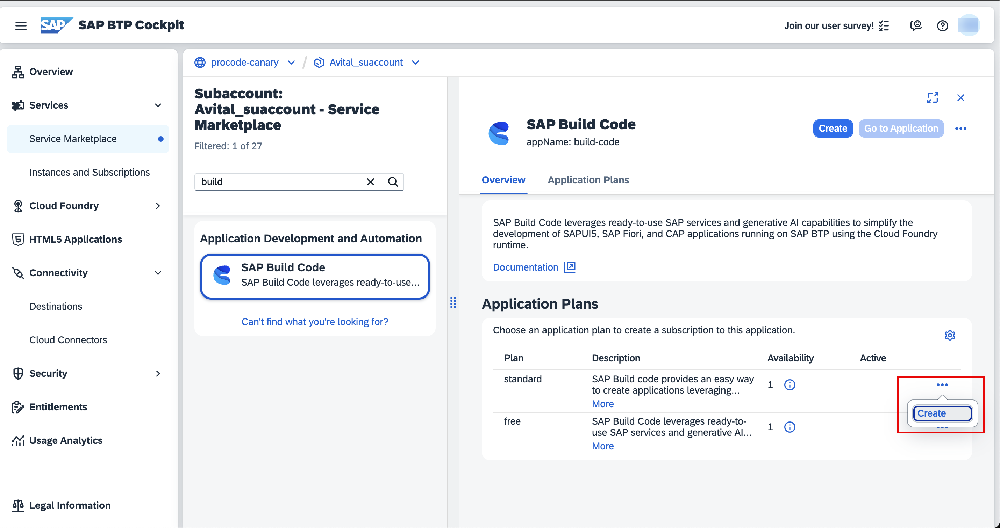

<!-- loio4cf7c698045346c5a9378c76016c72da -->

# Changing Plans

Learn about the options and restrictions for moving to different service plans.

You can change the service plan for your SAP Business Application Studio subscription according to the rules described in the table.

Select your current service plan and your target service plan so learn about your options.

****

<table>
<tr>
<th valign="top">

Current Plan

</th>
<th valign="top">

Target Plan

</th>
<th valign="top">

Explanation

</th>
</tr>
<tr>
<td valign="top">

SAP Business Application Studio, free plan

</td>
<td valign="top">

SAP Business Application Studio, standard plan

</td>
<td valign="top">

This transition is possible only if the subaccount is not subscribed to SAP Build Code.

</td>
</tr>
<tr>
<td valign="top">

SAP Business Application Studio, free plan

</td>
<td valign="top">

SAP Business Application Studio, build-code plan

</td>
<td valign="top">

This transition is possible only if there already is an SAP Build Code subscription in the subaccount.

</td>
</tr>
<tr>
<td valign="top">

SAP Business Application Studio, standard plan

</td>
<td valign="top">

SAP Business Application Studio, build-code plan

</td>
<td valign="top">

This transition is possible only if there already is an SAP Build Code subscription in the subaccount.

</td>
</tr>
<tr>
<td valign="top">

SAP Business Application Studio, standard plan

</td>
<td valign="top">

SAP Business Application Studio, free plan

</td>
<td valign="top">

This scenario is not supported.

</td>
</tr>
<tr>
<td valign="top">

SAP Business Application Studio, build-code plan

</td>
<td valign="top">

SAP Business Application Studio, standard plan

</td>
<td valign="top">

This scenario is not supported.

</td>
</tr>
<tr>
<td valign="top">

SAP Business Application Studio, build-code plan

</td>
<td valign="top">

SAP Business Application Studio, free plan

</td>
<td valign="top">

This scenario is not supported.

</td>
</tr>
</table>

<a name="loio4cf7c698045346c5a9378c76016c72da__section_dzc_j1z_tpb"/>

## Upgrading from the standard or free plan to the build-code plan

> ### Note:  
> If you want to move to the build-code plan, you need to have a subscription to SAP Build Code.
> 
> 1.  In the navigation area, choose *Service Marketplace*.
> 2.  Search for `Build Code`.
> 3.  Under *Application Plans*, click the 3 dots in the line for the standard plan, and click *Create*.
> 
>     

1.  Open your global account in the cockpit.
2.  Go to your subaccount.
3.  In the navigation area, choose *Entitlements*.
4.  Search for SAP Business Application Studio, and under *Available Plans,* select *build-code \(Application\)*.

    

5.  In the navigation area, choose *Instances and Subscriptions*.

    A list of the applications to which your subaccount is subscribed in the Cloud Foundry environment is displayed.

6.  Search for SAP Business Application Studio.
7.  Select the ellipsis at the end of the subscription row, and from the menu, click *Update*.

    

8.  In the wizard that opens, select the build-code plan, and click *Update Subscription*.

<a name="loio4cf7c698045346c5a9378c76016c72da__section_gpl_y5c_1bc"/>

## Upgrading from the free plan to the standard plan

1.  Open your global account in the cockpit.
2.  Go to your subaccount.
3.  In the navigation area, choose *Instances and Subscriptions*.

    A list of the applications to which your subaccount is subscribed in the Cloud Foundry environment is displayed.

4.  Search for SAP Business Application Studio.
5.  Select the ellipsis at the end of the subscription row, and from the menu, click *Update*.

    

6.  In the wizard that opens, select the standard plan, and click *Update Subscription*.

    > ### Note:  
    > If you don't see the standard-edition plan in the list, make sure that there's an entitlement for SAP Business Application Studio in your subaccount. See [Configure Entitlements and Quotas for Subaccounts](https://help.sap.com/products/BTP/65de2977205c403bbc107264b8eccf4b/5ba357b4fa1e4de4b9fcc4ae771609da.html).

> ### Note:  
> -   The content of the existing dev spaces is not affected by the update.
> 
> -   No changes are made to the user permissions.
> 
> -   The free tier restrictions are not applied anymore.
> 
> -   Restart your dev space to see the extended disk space.

