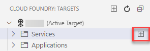

<!-- loio9ad5cf8dc1444f3081f0e847c8588fc0 -->

# Cloud Foundry Tools

Connect and perform actions on the Cloud Foundry environment.

You can access the Cloud Foundry tools by opening the command palette and entering `CF`. You can also create a list of pre-defined targets using the *CLOUD FOUNDRY: TARGETS* view.

<a name="loio9ad5cf8dc1444f3081f0e847c8588fc0__section_drx_lcp_54b"/>

## Login to Cloud Foundry

You must be logged in to Cloud Foundry to use the Cloud Foundry Tools.

1.  In the command palette, select `CF: Login to Cloud Foundry`. The *Cloud Foundry Sign In and Targets* page opens.
2.  Select the type of authentication method you prefer.

    See [Connecting to Cloud Foundry Using Identity Providers](connecting-to-cloud-foundry-using-identity-providers-53dfab0.md).

3.  Depending on the method you selected, enter your username and Cloud Foundry password or your temporary SSO authentication code.
4.  Select the organization to which you want to connect.
5.  Select the desired space within the organization.

Click on the status bar to change the target.

<a name="loio9ad5cf8dc1444f3081f0e847c8588fc0__section_mcy_plz_jvb"/>

## Select Cloud Foundry Target

1.  Select the organization to which you want to connect.
2.  Select the desired space within the organization.
3.  Click *Apply*.

<a name="loio9ad5cf8dc1444f3081f0e847c8588fc0__section_xzm_fdp_54b"/>

## Set Org and Space

You can change the organization and space you defined when logging into Cloud Foundry.

1.  In the command palette, select `CF: Select a space from your allowed spaces`. The *Cloud Foundry Sign In and Targets* page opens.
2.  Select the organization to which you want to connect.
3.  Select the desired space within the organization.

<a name="loio9ad5cf8dc1444f3081f0e847c8588fc0__section_v5f_kz4_54b"/>

## Create a New Service Instance

Create service instance in your current Cloud Foundry org and space. You can later consume this service for your development needs.

1.  In the command palette, select `CF: Create a service instance`.
2.  Provide a service instance name. The name must be unique, if you enter an already existing name, the creation fails.
3.  Select a Cloud Foundry service.
4.  Select the service plan that best fits your service instance.
5.  Optional: Provide additional parameters for the service instance. You can also press [Enter\] to enter an empty parameter.

> ### Note:  
> You can create a service instance in the *CLOUD FOUNDRY: TARGETS* view. The *CLOUD FOUNDRY: TARGETS* view opens.
> 
> 1.  Click  from the activity bar.
> 2.  Click  \(*Create a service instance*\) next to the *Services* folder under the active target.

<a name="loio9ad5cf8dc1444f3081f0e847c8588fc0__section_rm1_1dp_54b"/>

## Create a User-Provided Service Instance

With a user-provided service instance, you can use services that are not available in the marketplace.

1.  From the activity bar, click . The *CLOUD FOUNDRY: TARGETS* view opens.
2.  Click  next to the *Services* node under the active target.

    

3.  In the command center, provide a service instance name. The name must be unique, if you enter an already existing name, the creation fails.
4.  Select a Cloud Foundry service.
5.  Select the service plan that best fits your service instance.
6.  Optional: Provide additional parameters for the service instance. You can also press [Enter\] to enter an empty parameter.

<a name="loio9ad5cf8dc1444f3081f0e847c8588fc0__section_w1f_mcp_54b"/>

## Bind a Service to a Locally Run Application

1.  In the command palette, select `CF: Bind a service to a locally run application`.
2.  Select the folder where the `.env` file will be created. This file contains the information for connecting to the Cloud Foundry service.
3.  Click *OK*.
4.  Select the service instance to which you want to bind.

> ### Note:  
> You can also bind a service to an application using the *CLOUD FOUNDRY: TARGETS* view by right-clicking on the desired service and clicking *Bind a service to a locally run application*.

<a name="loio9ad5cf8dc1444f3081f0e847c8588fc0__section_xfz_bdp_54b"/>

## Create a New Cloud Foundry Target

You can create a list of frequently used Cloud Foundry targets. You can then move from one target to the next with only one click.

1.  From the left side menu, click The *CLOUD FOUNDRY: TARGETS* view opens. The *CLOUD FOUNDRY: TARGETS* view opens.
2.  Click  \(Create a Cloud Foundry target\)
3.  Click *Create New* in the command center. The target is based on the current org and space to which you are connected.
4.  Provide a name for the target.

You can change the current target in three different ways:

-   Log in to Cloud Foundry using a different endpoint.
-   Select a different organization and space within the current endpoint.
-   Select a different space within the current organization.

Once you have set up your targets, you can define which one will be the active target by clicking  \(*Set Cloud Foundry Target*\) by the desired target name.

<a name="loio9ad5cf8dc1444f3081f0e847c8588fc0__section_xmc_2dp_54b"/>

## Reload the Targets Tree

If the target tree is not showing updated information, you can manually trigger a reload to refresh the view.

1.  In the command palette, select `CF: Reload Targets Tree`.

-   **[Connecting to Cloud Foundry Using Identity Providers](connecting-to-cloud-foundry-using-identity-providers-53dfab0.md "Connect to Cloud Foundry using the UI or the command line.")**  
Connect to Cloud Foundry using the UI or the command line.

