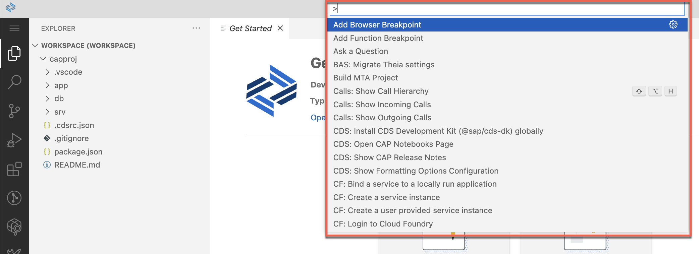

<!-- loio78788bf69e7c4834a2d3411b10c5d84a -->

# Command Palette

The command palette provides access to all the IDE functionality including shortcuts for the most common operations.

To open the command palette, select *View* \> *Command Palette...* from the left-side menu or press [F1\] \(Windows/Linux\) or [Command\] + [Shift\] + [P\] \(Mac\).

This will open an input field at the top of the IDE allowing you to type a command. Content assist then allows you to find commands quickly.

Some commands will lead you into a minimal text-based wizard, allowing you to enter additional parameters.

