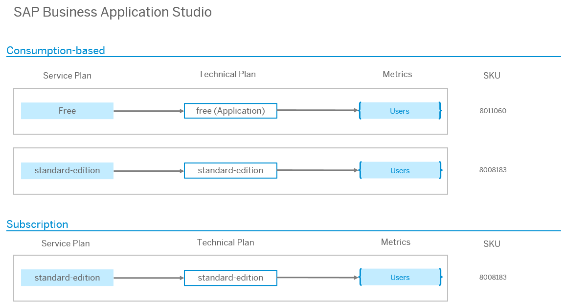

<!-- loio58a858cc29534c13bb36ce883dd31a8e -->

# Commercial Information

<a name="loio58a858cc29534c13bb36ce883dd31a8e__section_gwp_yyy_5zb"/>

## Service

### Description

SAP Business Application Studio is a powerful and modern development environment, tailored for efficient development of business applications for the Intelligent Enterprise. Available as a cloud service, it provides developers a desktop-like experience similar to market leading IDEs, while accelerating time-to-market with high-productivity development tools such as wizards and templates, graphical editors, quick deployment, and more.

### Overview

<a name="loio58a858cc29534c13bb36ce883dd31a8e__section_hbp_bwc_w1c"/>

## Service Plans

### SAP BTP Cockpit: Descriptions of the Service Plans

<table>
<tr>
<th valign="top">

Name in SAP BTP Cockpit

</th>
<th valign="top">

Service Plan in SAP Discovery Center

</th>
<th valign="top">

Description

</th>
</tr>
<tr>
<td valign="top">

standard

</td>
<td valign="top">

standard-edition

</td>
<td valign="top">

Use the plan for productive development in pre-configured dev spaces.

</td>
</tr>
<tr>
<td valign="top">

free

</td>
<td valign="top">

Free

</td>
<td valign="top">

Use the free offering for evaluation purposes.

Restrictions apply to the development environments.

Only community support is available for free tier service plans and these are not subject to SLAs.

</td>
</tr>
<tr>
<td valign="top">

build-code

</td>
<td valign="top">

Build Code

</td>
<td valign="top">

Use the build-code plan for productive AI-based development.

This option is available only if your subaccount is subscribed to SAP Build Code.

</td>
</tr>
<tr>
<td valign="top">

trial

</td>
<td valign="top">

Trial

</td>
<td valign="top">

Use the trial offering for evaluation purposes.

The use of this service is limited to two dev spaces per user.

A user can only have one dev space in the RUNNING state at a time.

Any dev space that has not been in a running state for 30 consecutive days will be deleted.

</td>
</tr>
</table>

<a name="loio58a858cc29534c13bb36ce883dd31a8e__section_x43_x1z_5zb"/>

## Metrics

<table>
<tr>
<th valign="top">

Metric

</th>
<th valign="top">

Definition

</th>
</tr>
<tr>
<td valign="top">

Users

</td>
<td valign="top">

Individuals authorized to access the Cloud Service. For purposes of Platform Cloud Services, users include individuals authorized to access a platform application.

</td>
</tr>
</table>

<a name="loio58a858cc29534c13bb36ce883dd31a8e__section_mjy_gbz_5zb"/>

## Supplemental Terms and Conditions

For more information, see the [SAP Business Technology Platform Service Description Guide](https://www.sap.com/about/trust-center/agreements/cloud/cloud-services.html?sort=latest_desc&tag=language%3Aenglish&pdf-asset=82ce6fed-917e-0010-bca6-c68f7e60039b&page=1), section 36.

<a name="loio58a858cc29534c13bb36ce883dd31a8e__section_bl4_4tz_5zb"/>

## Glossary

[Commercial Information Glossary](https://help.sap.com/docs/help/5d771150f8f547c6bc604c7d674cf30d/7014f9db099148f1897c1bda5db21f39.html)

