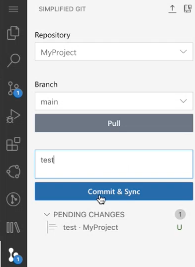

<!-- loio4612c90f5a51470396db9c7e0cdb4e76 -->

# Commit Changes in the Simplified Git View

In the *SIMPLIFIED GIT* view, you can add the current changes to the last commit.

To add your changes to the remote Git repository, enter a message describing your changes and click *Commit & Sync*.

