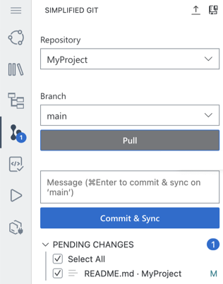

<!-- loio4612c90f5a51470396db9c7e0cdb4e76 -->

# Commit Changes in the Simplified Git View

In the *SIMPLIFIED GIT* view, you can add the current changes to the last commit.

You can see a list of all changes in the *PENDING CHANGES* section.

For example, if you make a change to the project from the terminal, the change is automatically detected and appears in the *PENDING CHANGES* section.

To add your changes to the remote Git repository, perform the following steps:

1.  In the *PENDING CHANGES* section, select the files with changes that you want to include in the commit.
2.  Enter a message describing your changes and click *Commit & Sync*.

