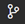

<!-- loio0930e56885944a2dbef1bc98ac12b4f0 -->

# Connecting an Existing Project to Git

You can add an existing project to Git.

1.  In the Project Explorer, select you project.
2.  Click  from the activity bar to open the Git view.
3.  Click  to initialize the local repository.
4.  Click  in the *Changes* section to add the files in your new local repository. This stages them for the first commit.

    

5.  Click  \(or press  [<Ctrl\>\] + [<Enter\>\] \) to commit the files that you've staged in your local repository.

    

6.  When prompted, provide a commit message. Your project is now connected to your local Git repository.

<a name="loio0930e56885944a2dbef1bc98ac12b4f0__section_v2h_tmc_lsb"/>

## Adding a Project to Git Remote

1.  Click  from the activity bar to open the Git view.
2.  Click  to see more available actions.
3.  Select *Remote* \> *Add Remote*.
4.  When prompted, add the URL for the remote repository where your local repository will be pushed.
5.  Push the changes in your local repository to the remote Git repository. See [Push Changes](push-changes-c1d3584.md).

