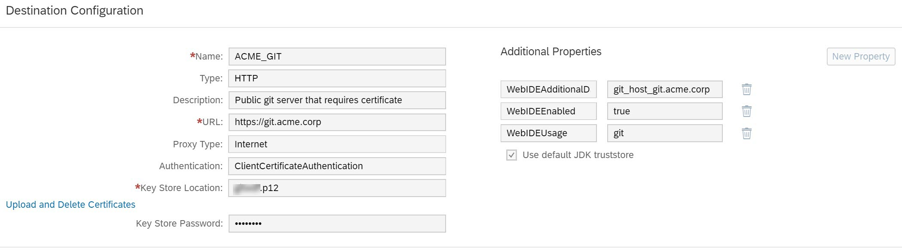

<!-- loio3d0c374301df468bb808b68cddb8b9a6 -->

# Connecting to a Public Git Server that Requires a Certificate

You can manage the connectivity to a public Git server that requires a client certificate.

<a name="loio3d0c374301df468bb808b68cddb8b9a6__context_wlz_pbz_rgb"/>

## Context

> ### Note:  
> The Git connectivity supports only secure HTTPS connections. HTTP, SSH and other protocols are not supported.

<a name="loio3d0c374301df468bb808b68cddb8b9a6__steps_bgv_s22_hx"/>

## Procedure

1.  In the SAP BTP cockpit, select *Connectivity* \> *Destinations*.

2.  Select *New Destination*.

3.  In the *Destination Configuration* section, do the following:

    1.  Set *Proxy Type* to *Internet*.

    2.  Set *Authentication* to *ClientCertificateAuthentication*.

    3.  Upload the client certificate in the *Key Store Location* field.

    4.  Enter your *Key Store Password*.

4.  In the *Additional Properties* section, configure the following:

    <table>
    <tr>
    <th valign="top">

    Property

    
    </th>
    <th valign="top">

    Value

    
    </th>
    </tr>
    <tr>
    <td valign="top">
    
    WebIDEEnabled

    
    </td>
    <td valign="top">
    
    true

    
    </td>
    </tr>
    <tr>
    <td valign="top">
    
    WebIDEUsage

    
    </td>
    <td valign="top">
    
    git

    
    </td>
    </tr>
    <tr>
    <td valign="top">
    
    WebIDEAdditionalData

    
    </td>
    <td valign="top">
    
    git\_host\_<Git host name\>

    The Git host name must be entered as it appears in the URL. For example, if the URL is `https://git.acme.corp:443`, the host name would be `git.acme.corp`.

    So you would enter in the field: `git_host_git.acme.corp`

    

    
    </td>
    </tr>
    </table>
    
5.  Select the *Use default JDK truststore* checkbox.

<a name="loio3d0c374301df468bb808b68cddb8b9a6__postreq_xlz_pbz_rgb"/>

## Next Steps

Test your new Git system by cloning a repository \(see [Cloning Repositories](cloning-repositories-7a68bfa.md)\) or by initializing a local repository, setting the remote repository, fetching and pushing to the remote repository.

