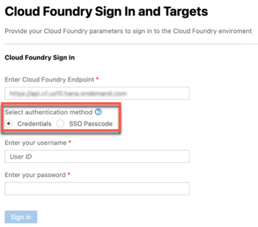
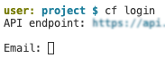

<!-- loio53dfab0d97d0476b8327d0ab63342e62 -->

# Connecting to Cloud Foundry Using Identity Providers

Connect to Cloud Foundry using the UI or the command line.

The manner in which you can connect to Cloud Foundry depends on the identity provider \(IdP\) you use.

<a name="loio53dfab0d97d0476b8327d0ab63342e62__section_ncw_4jf_drb"/>

## Comparison Between the Different Identity Providers for Cloud Foundry Login in SAP Business Application Studio

<table>
<tr>
<th valign="top">

 

</th>
<th valign="top">

SAP ID Service

</th>
<th valign="top">

Custom IdP

</th>
<th valign="top">

Corporate IdP

</th>
</tr>
<tr>
<td valign="top">

SAP Business Application Studio UI-based login with username and password

</td>
<td valign="top">

Supported

</td>
<td valign="top">

Not supported

</td>
<td valign="top">

Not supported

</td>
</tr>
<tr>
<td valign="top">

SAP Business Application Studio UI-based SSO login

</td>
<td valign="top">

Supported

</td>
<td valign="top">

Supported

</td>
<td valign="top">

Supported

</td>
</tr>
<tr>
<td valign="top">

SAP Business Application Studio CLI-based login

</td>
<td valign="top">

Supported

</td>
<td valign="top">

Supported

</td>
<td valign="top">

Supported

</td>
</tr>
<tr>
<td valign="top">

CLI-based login example

</td>
<td valign="top">

Reference

`cf login`

</td>
<td valign="top">

Reference

`cf login --origin <origin>`

</td>
<td valign="top">

Reference

`cf login --sso`

</td>
</tr>
<tr>
<td valign="top">

Authorization flow

</td>
<td valign="top">

OAuth Resource Owner Password

</td>
<td valign="top">

OAuth Resource Owner Password

</td>
<td valign="top">

OAuth Authorization Code Grant \(browser flow\) + One-Time Passcode

</td>
</tr>
</table>

For more information, see [this blog](https://blogs.sap.com/2021/04/21/connecting-from-sap-business-application-studio-to-sap-btp-cloud-foundry-environment/).

