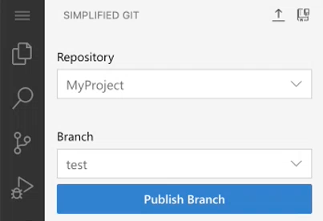

<!-- loioaee0b08d994c421b812ca3044a6954fb -->

# Create a Branch in the Simplified Git View

You can create a new branch using the *SIMPLIFIED GIT* view and publish it to the remote repository.

1.  From the *Branch* section, open the dropdown list and select *\+ Add New Branch*.
2.  Enter a name for the new branch.
3.  Select one the following options:

    -   *main*: To create a branch of the main directory on the local repository
    -   *origin/main*: To create a branch of the main directory on the remote repository

    The new branch is added to the dropdown list in the *Branch* section.

4.  Select *Publish Branch* to sync the new branch with the remote repository.

    

