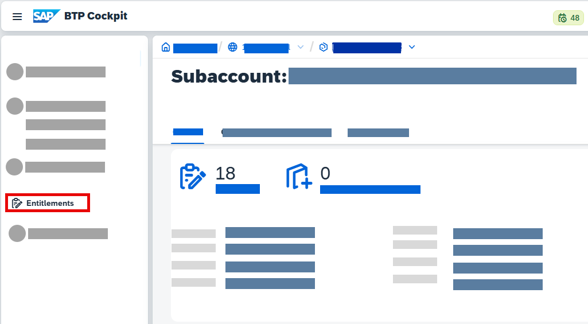
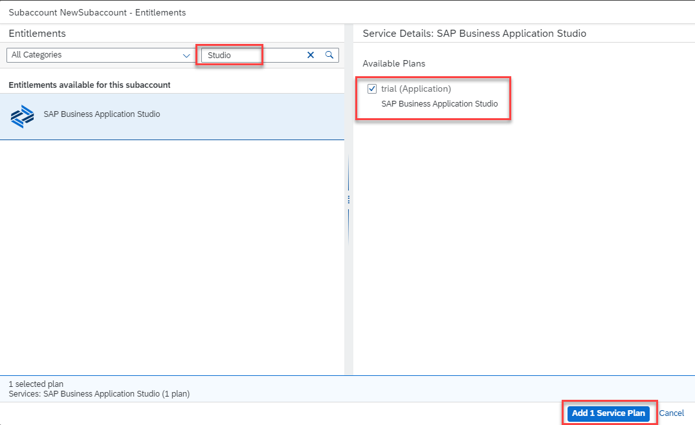
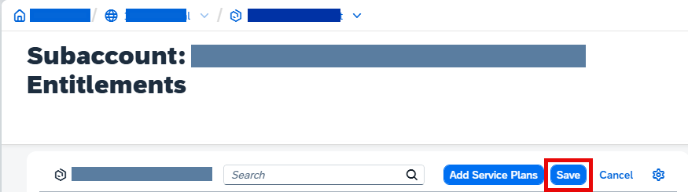

<!-- loioc44668ec8b4546da8b7bcc4b8e7a218a -->

# Creating a New Subaccount

Your trial account comes with a default subaccount that contains all the relevant roles and authorizations. You can create additional subaccounts, if needed.

1.  From the SAP BTP cockpit, click *Go To Your Trial Account*.

    

2.  Click *Create* \> *Subaccount*.
3.  Fill in the required fields and click *Create*.
4.  Open your new subaccount.
5.  From the navigation area, click *Entitlements*.

    

6.  Click *Edit*.
7.  Click *Add Service Plans*.
8.  Search for `Studio`.
9.  Select SAP Business Application Studio and, under *Available Plans*, select *trial \(Application\)*.
10. Click *Add 1 Service Plan*.

    

11. Click *Save*.

    

12. From the navigation area, click *Service Marketplace*.
13. Search for `Studio`.
14. Select SAP Business Application Studio and click *Create*.
15. From the *New Instance or Subscription* dialog box, leave the default selections and click *Create*.
16. Click *View Subscription* to see the details of your new subaccount.
17. Click *Go to Application*.

