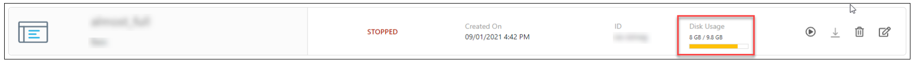
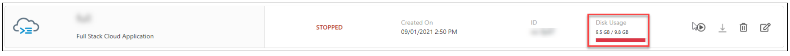
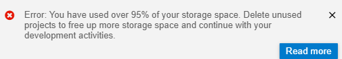
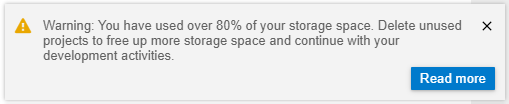
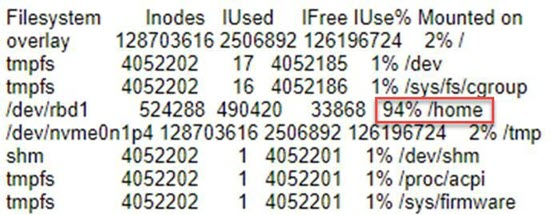
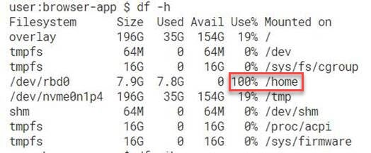

<!-- loio62003fa8096f47a99089395840a2cfdf -->

# Dev Space

Steps you can take if you have trouble when using your dev space.


<a name="loio62003fa8096f47a99089395840a2cfdf__section_qnp_wlw_znb"/>

## Your dev space remains in the STARTING state and doesn't switch to the RUNNING state

**Solution**

1.  Start a new dev space.
2.  Use Git to import your preview projects to your new dev space.

    For more information, see [Cloning Repositories](cloning-repositories-7a68bfa.md).

3.  Open an [Expert Chat](https://launchpad.support.sap.com/#/expertchat/create) to send the ID of the problematic dev space \(ws-id\) to dev support.


<a name="loio62003fa8096f47a99089395840a2cfdf__section_hdw_rcg_nnb"/>

## Your dev space is in the ERROR state or the SAFE MODE state

**Solution**

If your dev space is in the ERROR state, wait 5 minutes and try to open your dev space again.

If the problem persists, see the [Download Dev Space Content](working-in-the-dev-space-manager-ad40d52.md#loioad40d52d0bea4d79baaf9626509caf33__section_b5r_zhm_5jb) and the [Import Dev Space Content](working-in-the-dev-space-manager-ad40d52.md#loioad40d52d0bea4d79baaf9626509caf33__section_kjb_krb_hmb) sections for information about recovering data from a dev space in the ERROR state and for more information about the SAFE MODE state.


<a name="loio62003fa8096f47a99089395840a2cfdf__section_jcp_44w_znb"/>

## Your newly created dev space is in the STOPPED state

**Solution**

If your newly created dev space is in the STOPPED state, check how many dev spaces are in the RUNNING state.

-   If you are using the standard-edition plan, you can only have two dev spaces running at a time.
-   If you are using the free plan, you can only have one dev space running at a time.

If you want to run the new dev space, stop another dev space and then start the new dev space.


<a name="loio62003fa8096f47a99089395840a2cfdf__section_ilv_szw_l4b"/>

## You can't delete any more dev spaces

**Reason**

If you can't delete any more dev spaces, you may have reached the maximum number of dev spaces that you can delete.

If you are using the standard-edition plan:

-   Each dev space is deleted after a 30-day retention period.
-   You can only have up to 100 dev spaces in a retention period.

If you are using the free plan:

-   Each dev space is deleted after a 14-day retention period.
-   You can only have up to 50 dev spaces in a retention period.

The reason for the limit on deletions is for security and to prevent cyber attacks.


<a name="loio62003fa8096f47a99089395840a2cfdf__section_esh_pcf_j4b"/>

## You receive an error describing no space left on your dev space

**Problem**

If you encountered one of the following problems, perform the following steps to identify the cause of this error.

Dev Space inode capacity reaching its maximum:



Dev Space inode capacity at its maximum:



Dev Space inode usage is over 95%:



Dev Space inode usage is over 80%:



**Solution**

1.  Check inode usage:

    From the terminal, run the `df -ih` command to display information about the usage of file system inodes.

    

    If inode usage is close to 100%, you can't create more files or run commands that create files, including npm commands.

2.  Check disk space usage:
    1.  From the terminal, run the `df -h` command to display the size of used and available disk space in the disk drives.
    2.  Check the `/home` rows from the results.

        If the disk space usage is close to 100%, you can't create more files or run commands that create files, including npm commands.


3.  If the usage is close to 100%, clean up some space:
    1.  Determine which folder uses a lot of inodes by running the following command from the terminal:

        ```
        for i in /home/*; do echo $i; find $i |wc -l; done
        ```

        You can run this command many times, but with different paths \(for example, you can change `/home/*` to `/home/projects/*/`\).

        Check if you can delete files from paths that contain a lot of files.

    2.  Find all zero-byte files in directory and subdirectories by running the following command:

        ```
        Run: find /path/to/dir -size 0
        ```

        Delete all zero-byte files.

    3.  Clean the Trash folder in the `/home/user/.local/share/Trash/files` path by running the following command:

        ```
        rm -rf /home/user/.local/share/Trash/files
        ```

    4.  Clean the yarn cache folder in the `/home/user/.local/cache` path by running the following command:

        ```
        rm -rf /home/user/.cache
        ```

    5.  Clean the npm cache folder in the `/home/user/.npm` path by running the following command:

        ```
        rm -rf /home/user/.npm
        ```


4.  If the usage is still 100%, move projects to another dev space.
    1.  Create a new dev space from the Dev Space Manager.
    2.  Export the project using Git or download the project \(right-click the project's root folder and select *Download*\).
    3.  Import the project to the new dev space using Git clone or drag the exported archive to the target location in the file explorer tree.

5.  [Contact SAP Support](contact-sap-support-a3467fe.md) if you are still facing issues.


<a name="loio62003fa8096f47a99089395840a2cfdf__section_tbh_tmp_fdc"/>

## You receive an error that some extensions were not fully installed

**Error**

When you open your dev space, you receive the following error message:

*Some extensions were not fully installed. You can continue to work in*SAP Business Application Studio*and we will retry next time you restart the dev space.*

**Solution**

1.  Click *Installation Details*.

    The log opens.

2.  Find which extension is not installed in the log.
3.  Open a ticket on the component that is mentioned in the log.

    For example, you can open a ticket with the following information:

    `Installation summary of the "xxx /xxx " extension (created by "SAP (xxx-xxx-xxx-xxx)")`

    Make sure to attach the log to the reported ticket.

    If no component is mentioned in the log, then the component is an SAP Business Application Studio extension. Report the component on CA-BAS-FWK-EXT.


