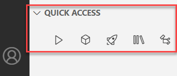

<!-- loio780ba0f7049248c782de1f7f66b8b391 -->

# Explorer

Use the project explorer to browse the contents of your current workspace.

<a name="loio780ba0f7049248c782de1f7f66b8b391__section_z1g_wmn_c1c"/>

## Project Explorer

The project explorer displays application components in a logical view, which simplifies browsing of the contents of your application.

It gives you a bird's-eye view of the components involved in your application at any point in time.

Open the project explorer from the activity bar.

<a name="loio780ba0f7049248c782de1f7f66b8b391__section_chn_ymn_c1c"/>

## Outline

The Outline view displays a symbol tree of the currently active editor. This view is useful for understanding the structure of a file or for navigating to a specific element in a file.

You can click on an element in the Outline view to open that element in the editor tab.

To open the Outline view, select *Explorer: Focus on Outline View* from the command palette.

The Outline view opens on the side of the IDE, within the Explorer view.

<a name="loio780ba0f7049248c782de1f7f66b8b391__section_qfy_fnn_c1c"/>

## Quick Access

The Quick Access view allows you to open the most used funtions with one click.

