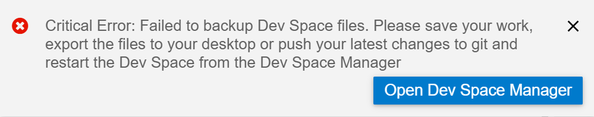

<!-- loioeb325ff0ac2a4f0ba19fd5851aa0fdf2 -->

# File Backup

Steps you can take if you have trouble backing up your files.

<a name="loioeb325ff0ac2a4f0ba19fd5851aa0fdf2__section_ew3_kml_wmb"/>

## You receive a popup error message describing failure of the backup of your dev space files

**Problem**

This issue may occur when some, or all, of your dev space content isn’t being backed up.

If you don’t perform the steps in the error message, you will lose some or all of your recent changes.

**Solution**

Perform the following steps to save your changes:

1.  Save your changes in all open SAP Business Application Studio files.
2.  If you work with a Git repository, push all your latest changes.
3.  Navigate to the Dev Space Manager.
4.  Export the project. See [Dev Space Types](dev-space-types-4142f78.md) for instructions.
5.  Restart the dev space.
6.  Import the project.
    -   If the issue is resolved, import the project to add lost changes.
    -   If the issue persists, create a new dev space and then import the project.

> ### Note:  
> We always recommend syncing, backing up, and saving your project to a remote Git Repository. You should store all changes in Git branches.

