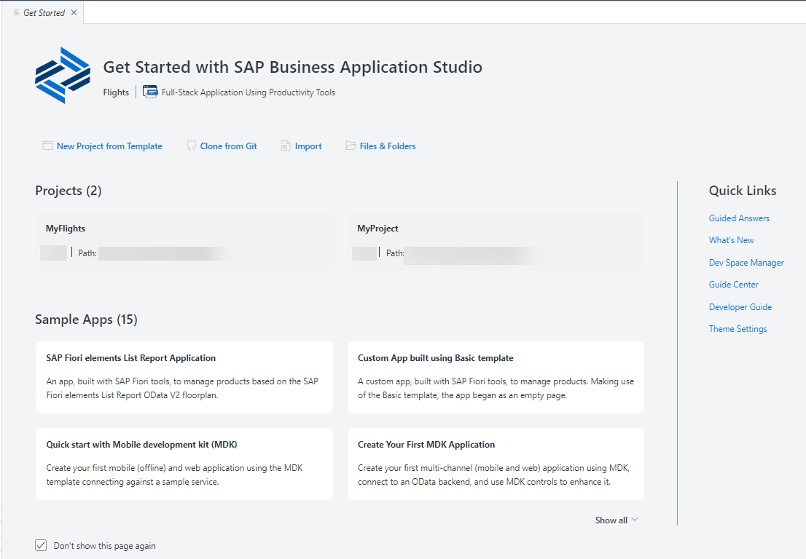

<!-- loio28f418e485e54eda828bb0ce0572dbff -->

# Get Started Page

The *Get Started* page provides you contextual links useful to users at the beginning of their development cycle.

The *Get Started* page is displayed when you open your dev space or enter `Get Started` in the [command palette](https://help.sap.com/products/SAP%20Business%20Application%20Studio/9d1db9835307451daa8c930fbd9ab264/78788bf69e7c4834a2d3411b10c5d84a.html?version=Cloud).

It includes the following sections:

-   Quick access to common activities that are relevant for your dev space
-   Quick access to the projects in the dev space.
-   Sample applications relevant for your dev space
-   Important links to documentation and help tools.

