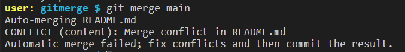
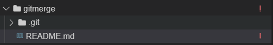

<!-- loio588c283f301c42bf94871d3ba6f47f92 -->

# Merge Changes

You can incorporate all the changes from one branch into another in a single commit.

To merge a branch into another:

1.  From the *SOURCE CONTROL* view menu, click More Actions.

    

2.  Select *Merge...*. The command palette opens.
3.  Select the branch you want to merge into the currently active branch.

<a name="loio588c283f301c42bf94871d3ba6f47f92__section_mlh_1j2_mrb"/>

## Dealing with Merge Conflicts

Merge operations can fail because of conflicts between the current branch and the branch you choose from which to incorporate the changes. To see which files have merge conflicts, navigate to the console or the explorer:

-   The console displays a list of all files with merge conflicts.

    

-   The explorer displays "!" next to any files with conflicts.

    

When you access a file with conflicts, the conflicts and the options for resolving them are displayed in the file.

Choose from the following options to resolve the merge conflict:

1.  *Accept Current Change*: Apply only the changes from the current branch.
2.  *Accept Incoming Change*: Apply only the changes from the target branch.
3.  *Accept Both Changes*: Merge both changes \(the first change from the current branch and the second change from the target branch\).
4.  *Compare changes*: View the differences \(current and target\) in a split window.

