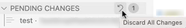

<!-- loio7aab4b6a630f40c4b1bb77fd829e1186 -->

# Perform Actions from the Pending Changes Section

You can discard all changes, individually ignore each pending change, or you can open an updated file from the *PENDING CHANGES* section.

<a name="loio7aab4b6a630f40c4b1bb77fd829e1186__section_qqh_qny_xwb"/>

## Discard All Changes

1.  From the *PENDING CHANGES* section, click the arrow to discard all changes.

    

2.  Confirm that you want to merge all files without any of your changes.

<a name="loio7aab4b6a630f40c4b1bb77fd829e1186__section_fnw_sny_xwb"/>

## Ignore Pending Changes Individually

Click  \(Add to .gitignore\) to ignore pending changes individually.

<a name="loio7aab4b6a630f40c4b1bb77fd829e1186__section_bb4_p4y_xwb"/>

## Open Updated File

Click  \(Open File\) to open an updated file.

