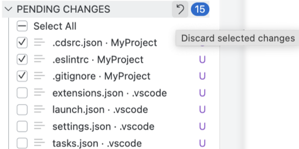
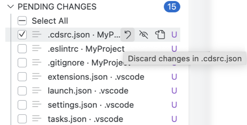

<!-- loio7aab4b6a630f40c4b1bb77fd829e1186 -->

# Perform Actions in the Pending Changes Section

You can discard all selected changes, individually discard or ignore each pending change, or you can open an updated file in the *PENDING CHANGES* section.

<a name="loio7aab4b6a630f40c4b1bb77fd829e1186__section_qqh_qny_xwb"/>

## Discard Changes

Discarding removes changes from the active branch.

In the *PENDING CHANGES* section, discard the relevant changes:

-   To discard the selected changes, hover over the *PENDING CHANGES* section title and click .

    

-   To discard changes for an individual file, hover over the file containing the changes you want to discard and click .

    

<a name="loio7aab4b6a630f40c4b1bb77fd829e1186__section_fnw_sny_xwb"/>

## Ignore Pending Changes Individually

Click  \(Add to .gitignore\) to ignore pending changes individually.

<a name="loio7aab4b6a630f40c4b1bb77fd829e1186__section_bb4_p4y_xwb"/>

## Open Updated File

Click  \(Open File\) to open an updated file.

