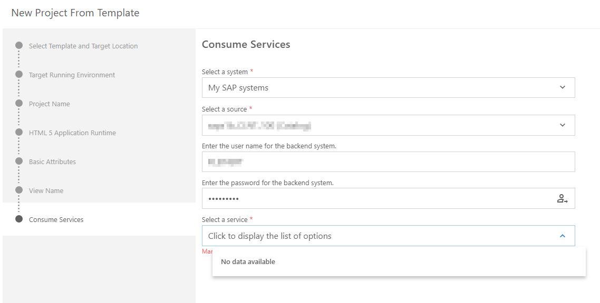

<!-- loio6939978f24af4990a8f0de666c9a1387 -->

# Project Creation

Steps you can take if you have trouble when creating a project.

<a name="loio6939978f24af4990a8f0de666c9a1387__section_unw_jtb_xnb"/>

## No services are available for selection in the Consume Services step of project creation

This issue may occur if some of the required properties are missing for your destination.

**Solution**

Make sure that your destination is set up with the following properties:

<table>
<tr>
<th valign="top">

Property

</th>
<th valign="top">

Value

</th>
</tr>
<tr>
<td valign="top">

`WebIDEEnabled`

</td>
<td valign="top">

`true`

</td>
</tr>
<tr>
<td valign="top">

`HTML5.DynamicDestination`

</td>
<td valign="top">

`true`

</td>
</tr>
</table>

See [Connecting to External Systems](connecting-to-external-systems-7e49887.md) for more information.

