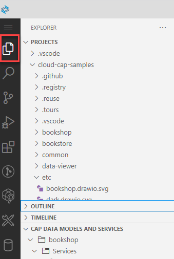

<!-- loio780ba0f7049248c782de1f7f66b8b391 -->

# Project Explorer

Use the project explorer to browse the contents of your current workspace.

The project explorer displays application components in a logical view, which simplifies browsing of the contents of your application.

It gives you a bird's-eye view of the components involved in your application at any point in time.

Open the project explorer from the activity bar.

