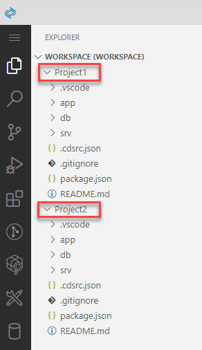
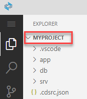

<!-- loio0919ce1ca4a342628e49c0f5e9c8cdcf -->

# Project Visibility in SAP Business Application Studio

Projects are displayed in the file explorer within a workspace or as stand-alone folders.

A workspace is an entity containing your project's settings, debug configurations, and task configurations.

We recommend you work in an environment where projects reside in a multi-root workspace.

In SAP Business Application Studio, a workspace is created for you as part of the project creation wizard. If a workspace is already open, new projects are added to it by default.

Working in a multi-root workspace environment means that you can group projects that are saved in different locations or even in different workspaces. All project files are visible in the file explorer under the same workspace.

You also have the option to open a project as a stand-alone folder, and not belonging to a workspace.

1.  From the left-side menu, select *File* \> *Open Folder...*.
2.  Select the desired project and click *Open*. The project opens as the root folder in the file explorer.

<a name="loio0919ce1ca4a342628e49c0f5e9c8cdcf__section_djg_l4d_4nb"/>

## Reopening a Workspace

If you already have a workspace in which you want to create your project, click *Open Workspace* in the file explorer or from the left-side menu, select *File* \> *Open Workspace from File...* and select the desired workspace file.

<a name="loio0919ce1ca4a342628e49c0f5e9c8cdcf__section_vt2_jxh_brb"/>

## Changing the Default Settings

If you do not want your projects to be opened in a workspace by default, you can change the settings.

1.  From the left-side menu, select *File* \> *Preferences* \> *Settings*.
2.  From the Settings page, select *Application Wizard*.
3.  Under *Workspace*, select the preferred default behavior from the dropdown list.

