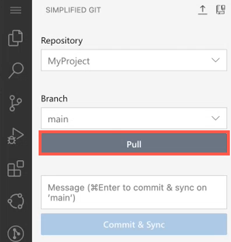

<!-- loiocd2408c0ad7f4be6b44ef1e5c175b8ca -->

# Pull Changes in the Simplified View

From the *SIMPLIFIED GIT* view, you can pull changes to download objects and references from the remote repository into your local repository, and then merge the changes into your project.

From the *PENDING CHANGES* section, you can see a list of all changes.

For example, if you make a change to the project from the terminal, the change is automatically detected and appears in the *PENDING CHANGES* section.

Click *Pull* to pull the changes made in the remote repository to your project.

